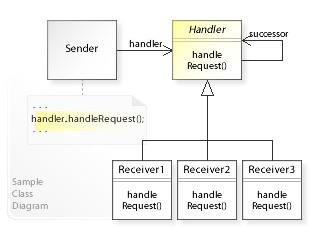

# GoFs Comportamentais

## Histórico de Revisão:
| Data | Versão | Descrição | Autor |
|---|---|---|---|
| 27/05/2019 | 0.1 | Adicionando Mediator | Renan Schadt e Rômulo Souza |
| 27/05/2019 | 0.2 | Adicionando Observer | Renan Schadt |

## 1. Introdução

## 2. GoFs Comportamentais

### 2.1 Mediator

#### 2.1.1 Definição
Mediator é um padrão de design comportamental que impede a comunicação direta entre objetos, tem a função de evitar uma rede caótica de dependências, para fazê-lo o Mediator força os objetos a se comunicar indiretamente, usando de um objeto "mediador".

Ao se chamar um objeto Mediator ele redireciona as requisições para os componentes apropriados, como resultado os componentes dependem apenas do Mediator ao invés de estarem ligados a diversas outras classes.

Este padrão permite encapsular uma complexa rede de relações entre componentes dentro de um objeto, tornando o sistema mais legível e fácil de modificar.

O padrão Mediator contém os seguintes elementos:

1. Diversos componentes, que são classes que contém lógica de negócio. Cada componente tem uma referência ao mediador, declarado com o tipo da interface do mediador.

2. Uma interface Mediator que declara métodos de comunicação entre componentes.

3. Uma classe Concrete Mediator que encapsula a relação entre vários componentes, guardando as suas referências e gerenciando seus ciclos de vida.

#### 2.1.2 Análise
Após avaliação dos Requisitos chegamos a conclusão que o padrão Mediator se aplica a uma área de nossa aplicação, onde uma classe mediadora organizaria os tradutores e revisores responsáveis por algum fragmento de texto específico.

O Django possui formas já definidas de realizar essa tarefa, que correspondem a lógica do Mediator, usaremos dessas funções.

#### 2.1.3 Estrutura Mínima

### 2.2 Observer

#### 2.2.1 Definição
Observer é um padrão de design comportamental, que define um mecanismo que notifica múltiplos objetos sobre qualquer evento que ocorra com o objeto que estão observando.

O objeto observado é normalmente definido como Publisher, pois divulga suas mudanças de estado. Os objetos que desejam acompanhar essas mudanças são chamados de Subscribers.

O padrão Observer sugere adicionar um mecanismo de inscrição a classe Publisher, para que outros objetos possam se inscrever ou desinscrever dos sinais disparados por aquele Publisher. É crucial que os Subscribers implementem a mesma interface do Publisher.

Assim que ocorre um novo evento, o Publisher itera sobre a lista de inscritos e chama o método de notificação declarado na interface do Subscriber, em cada objeto Subscriber presente na lista.

O padrão Observer contém os seguintes elementos:

1. Um Publisher, que é o elemento observado, contendo um sistema de inscrição, que permite que Subscribers o acompanhem ou deixem de acompanhá-lo.

2. Uma interface Subscriber, que declara a interface de notificação.

3. Classes de Concrete Subscribers, que realizam ações em resposta a eventos disparados pelo Publisher.

#### 2.2.2 Análise
Após a análise da documentação do Django chegamos a conclusão que este framework já aplica o Observer nativamente, não sendo necessária a construção da estrutura mínima descrita abaixo, visto que ela já está pronta.

#### 2.2.3 Estrutura Mínima

### 2.3 Chain of Responsability

#### 2.3.1 Definição

O Padrão Chain of Responsability é focado na delegação de funções para diferentes instâncias de uma mesma classe abstrata. Isto é, esse padrão configura a declaração de uma classe abstrata que é montada com métodos genéricos, bem como a funcionalidade de delegar a o funcionamento para uma outra instância de um elemento que herda dessa classe abstrata, seguindo uma ordem hierárquica.

A um primeiro momento, o conceito pode parecer complexo, mas é fundamental compreender que a implementação do padrão busca facilitar a execução de atividades sequências em um sistema, transformando comportamentos específicos em objetos que desempenham uma função específica. Assim, após crar uma classe abstrata com métodos base, incluindo um método que instancia um outro objeto do mesmo tipo dessa classe abstrata, é necessário implementar classes que herdam dessa primeira, visando tratar as requisições de forma linear, permitindo ainda que a requisição não prossiga na cadeia de objetos dependendo do contexto dos objetos que gerenciam.

Assim o padrão Chain of Responsability contém os seguintes elementos:

1. Uma interface *Handler* responsável por implementar a lógica básica das outras classes e a função de identificar a próxima instância, hierarquicamente;

2. Classes que herdam da interface, tidas como *Receivers* e que implementam, suas lógicas próprias;

3. Uma lógica externa, tida como *Sender* que faz a requisição para a cadeia implementada.

#### 2.3.2 Análise

O Padrão é uma boa saída para modularizar fluxos que seriam muito longos e acoplados no caso de uma cadeia de **if ... else if ... else** entretanto sua aplicação no projeto não se demonstrou viável a um primeiro momento, dado que os possívels fluxos para um dado estado não se encaixam em uma cadeia sequencial, tampouco se faz necesário pelas estruturas comparativas que existem no contexto da aplicação do projeto em Django.  
Uma vantagem evidente em relação ao uso de uma cadeia de if é a possibilidade de duas saídas possíveis para uma etapa, conforme a instância de um objeto permite, como no caso do cancelamento da continuidade da hirarquia.   
Um outro ponto positivo é a possibilidade da alteração da ordem de execução dos objetos sem mudanças extremas no fluxo, mantendo a conectividade entre os módulos (ou objetos).

#### 2.3.3 Estrutura Mínima

##### 2.3.3.1 Diagrama de Classes

##### 2.3.3.2 Diagrama de Sequência

#### 2.3.4 Exemplo Conceitual

Um exemplo interessante que ilustra essa cadeia é o processo de autenticação por etapas em uma aplicação, de forma que um usuário primeiro tenha que possuir um nome cadastrado na aplicação, posteriormente possuir uma senha válida e, em alguns casos, ocorre uma etapa de veriicação com questões específicas, sendo que em cada uma dessas etapas é possível uma falha do usuário bem como a completudo e prosseguimento do fluxo. No exemplo, cada etapa atuaria como *Receiver* de uma mesma classe abstrata.

## 3. Referências
* [Guru Design Patterns - Mediator](https://refactoring.guru/design-patterns/mediator)
* [Guru Design Patterns - Observer](https://refactoring.guru/design-patterns/observer)
* [Guru Design Patterns - Chain of Responsability](https://refactoring.guru/design-patterns/chain-of-responsibility)
* [Chain of Responsability Implementation](https://www.tutorialspoint.com/design_pattern/chain_of_responsibility_pattern.htm)
