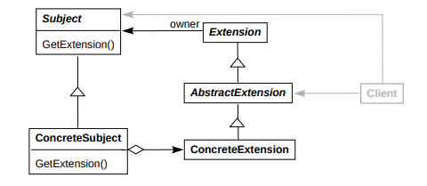
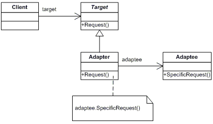
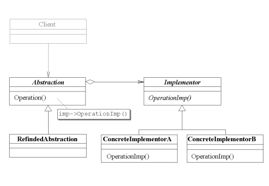
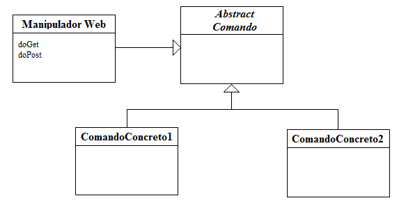

# GoFs Estruturais

## Histórico de Revisão:
| Data | Versão | Descrição | Autor |
|---|---|---|---|
|21/05|0.1|Adicionar decorator, extension e facade| João Robson|
| 23/05 | 0.2 | Inclusão do Adapter, Composite e Bridge | Helena Goulart |
| 23/05 | 0.3 | Inclusão da análise do Facade | Helena Goulart |
| 28/05 | 0.4 | Adiciona Front Controller | Gabriela Guedes|

## 1. Introdução  

GoFs estruturais são conhecidos por se preocuparem na forma na qual os objetos e classes se organizam na composição de uma estrutura maior. Se dividem entre padrões de classe e padrões de herança. Desse modo, os padrões de classe focam na utilização de heranças para composição de interfaces e implementações, enquanto o os de objetos propõe formas de utilização de modo a conseguir novas funcinoalidades.

## 2. GoFs Estruturais

## 2.1 Decorator

#### 2.1.1 Definição

Padrão que permite atribuir comportamentos ou estados a determinados objetos em tempo de execução,
diferentemente de uma herança, por exemplo, que é estática e se aplica à uma classe inteira.

##### Quando deve ser usado

* Uma estrutura formada por um objeto principal e vários componentes opcionais com um interface comum a todos;
* Herança é inviável porque definição da classe base está encapsulada/escondida;

#### 2.1.2 Análise

Esse padrão pode ser aplicado no projeto. Uma classe interessante
para sua aplicação, por exemplo, é a do Perfil do usuário. Além de poder atribuir
certificados e línguas a um perfil por meio de decorators, badges e prêmios obtidos
como parte da gamificção do site podem ser associados a uclasse do usuário
por meio de decorator também.

#### 2.1.3 Estrutura mínima

## 2.2 Extension Objets

#### 2.2.1 Definição

Padrão que permite extender a interface de um objeto no futuro.
Como em algumas abstrações é complicado antecipar completamente
seu funcionamento e determinar se determinada interface será realmente
usada em um cojunto de componentes relacionados, o padrão Extension Objects
provê uma estrutura que antecipa essas etensões opcionais.

Um exemplo disso é um checador gramatical em um editor de texto. Nem todos
componentes (imagens, gráficos, fórmulas, texto em si, etc.)
que podem ser inseridos podem ou necessitam dessa checagem. Nesse contexto,
haveria uma classe abstrata para os componentes, incluindo o checador.
Porém, em vez de adicionar a interface responsável por acessar o texto e
contar as palavras, por exemplo, em todos componentes e deiar sua implementação
vazia para componentes sem texto, o componente do checador se torna independente
e quando necessita ser usado, é chamado pelos componentes.

##### Quando deve ser usado
* Necessidade de adicionar funcionalidades novas ou imprevistas a determinadas classes
e não impactar classes que não necessitam dessas novas interfaces.

#### 2.2.2 Análise

Esse padrão não possui uma aplicabilidade clara no projeto, pelo menos por enquanto.

#### 2.2.3 Estrutura

## 2.3 Facade

#### 2.3.1 Definição

O padrão facade serve como um facilitador, interfaceando um conjunto de componentes
que pssuem relacionamentos e funcionalidades complexas. Isso ocorre por meio de uma classe
que encapsula esse subsistema complexo em uma única interface mais simplificada, reduzindo a curva de
aprendizado necessária para compreeder esse pedaço do sistema.

##### Quando deve ser usado

* Necessidade de prover uma interface simplificada que abstrai e torna mais fácil
o uso de funcionalidades de outros subsistemas mais complexos;

#### 2.3.2 Análise
Pode ser utilizado no translate.me, mas não é o mais recomendado, uma vez que é comumente utilizado em projetos complexos e com o escopo maior, o que não é o caso do projeto em questão. 

#### 2.3.3 Estrutura mínima

## 2.4 Adapter

### 2.4.1 Definição

Trata-se de um padrão que converte a interface de uma classe para outra interface. Isso normalmente ocorre quando classes precisam trabalhar mas possuem interfaces incompatíveis entre si.

### 2.4.2 Análise

Pode ser utilizado no translate.me, contudo não soa como uma boa prática: uma vez que o projeto terá seu início e fim acompanhando a disciplina Desenho e Arquitetura de Software, escopo reduzido e conter diagrama de classes e de arquitetura bem definidos, não tende a ser um sistema que vai adotar novas bibliotecas e que passará por adaptações a serem implementadas pelo _Adapter_.

### 2.4.3 Estrutura mínima

## 2.5 Bridge

### 2.5.1 Definição
Este padrão é utilizado para separar uma abstração de sua implementação, possibilitando que ambas atuem independentemente. O termo _"bridge"_ (ponte) é justamente essa ligação estabelecida entre a abstração e sua implementação.

Essa separação permite:
* Acoplamento de funcionalidades;
* Redução da complexidade da arquitetura.

### 2.5.2 Análise
É cabível de se utilizar o _Bridge_ no projeto translate.me, de modo a separar e agrupar responsabilidades que um usuário tradutor pode ter por exemplo, uma vez que atua tanto como tradutor como revisor, e pode ser também o autor de algum texto.

### 2.5.3 Estrutura mínima

## 2.6 Composite

### 2.6.1 Definição
Trata-se do agrupamento de objetos de modo a representar hierarquias parte-todo, permitindo tratar objetos individuais e composições uniformemente.

### 2.6.2 Análise

Pode ser utilizado no translate.me, inclusive é um padrão recomendado que o utilizem pois ele se encaixa com o escopo do projeto, uma vez que contempla a estrutura de editor de texto. Editores são compostos por elementos individuais, tais como palavras e letras, enquanto o texto é um elemento parte-todo, pois contém várias palavras dentro dele.  

### 2.6.4 Estrutura mínima

## 2.7 Front Controller
### 2.7.1 Definição
O front controller é um padrão de projeto que se comporta como um controlador para todas as requisições web da aplicação. Sua funcionalidade se deve para evitar duplicação de código, uma vez que as solicitações de um site são muito similares com passos que devem ser seguidos, como checar a segurança e fornecer uma página de resposta. Ao utilizar o front controller, a duplicação do código será então diminuida, uma vez que todas as requisições serão feitas por esse objeto que será instanciado pela classe do front controller.

Com o front controller, a aplicação possui um único ponto de entrada que trata de todas as requisições. Esse código e responsável por carregar as dependências, fazer o processamento da requisição e levar a resposta para o navegador, chamando a página correta de acordo com a requisição feita.

#### Funcionamento
O front controller é dividido em 2 partes:

* __Manipulador Web:__ Trata as requisições da aplicação. Extrai as informações necessárias da URL e então decide as ações que serão tomadas, o manipulador delega essas ações para serem executadas por um objeto Comando.

* __Comando:__ Executa as ações e escolhe qual página utilizar para a resposta.

### 2.7.2 Análise
Este padrão não pode ser aplicado no projeto. O front-end do translate.me é feito com React JS, que não segue o padrão MVC, segue um padrão próprio,  onde não há a separação de View e Controller, todas as Views são "controller-views". Como esse padrão exige a separação de uma controller para fazer a manipulação das requisições e as views chamadas, não é possível utilizá-lo com este framework.

### 2.7.3 Estrutura mínima

## 3. Referências

### Links de sites

* [Klevas - Extension Objects Pattern](https://klevas.mif.vu.lt/~plukas/resources/Extension%20Objects/ExtensionObjectsPattern%20Gamma96.pdf)  
* [SourceMaking - Design Patterns](https://sourcemaking.com/design_patterns)
* [DevMedia - Adapter](https://www.devmedia.com.br/padrao-de-projeto-adapter-em-java/26467).  
* [UFCG - Composite](http://www.dsc.ufcg.edu.br/~jacques/cursos/map/html/pat/composite.htm).
* [SourceMaking - Bridge Java](https://sourcemaking.com/design_patterns/bridge/java/1)
* [DevMedia - Front Controller](https://www.devmedia.com.br/padroes-de-projetos-introducao-aos-padroes-front-controller-e-command/30644)

### Livros e artigos
[1] HUMMEL, Oliver; ATKINSON, Colin. The managed adapter pattern: Facilitating glue code generation for component reuse. In: International Conference on Software Reuse. Springer, Berlin, Heidelberg, 2009. p. 211-224.
