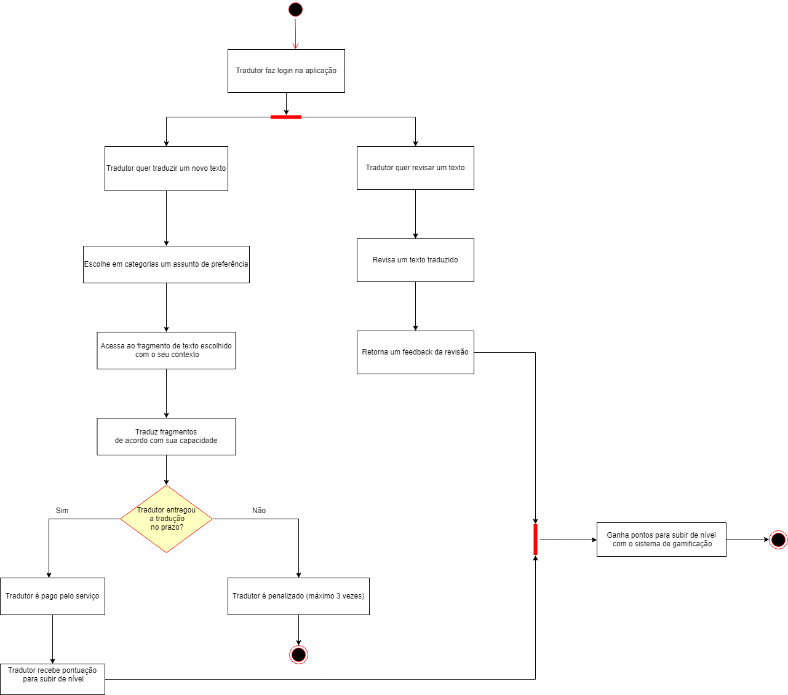

# UML Dinâmicos

## Histórico de Revisão:
| Data | Versão | Descrição | Autor |
|---|---|---|---|
| 26/04/2019 | 0.1 | Adicionando diagrama de sequência de submissão e acompanhamento | Victor Hugo, Renan Schidt |
| 26/04/2019 | 0.2 | Adicionando diagrama de atividades e de sequência de escolha e acesso de fragmento de texto  | Letícia Meneses, Luiz Guilherme|
| 29/04/2019 | 0.3 | Adicionando diagrama de colaboração | Gabriela Guedes e Helena Goulart |
| 03/05/2019 | 0.4 | Adicionado diagrama de atividade | Davi Alves e João Robson|

## 1. Introdução

Diagramas dinâmicos são compreendidos como diagramas de interação, diagramas de máquinas de estados e diagramas de atividade, e são usados ​​para descrever o comportamento interno de um sistema. Sâo exemplos de diagramas dinâmicos: diagrama de sequência, diagrama de colaboraçâo, diagrama de atividades, diagrama de estados. 

## 2. Artefatos

### 2.1. Diagramas de Sequência

Diagrama de sequência é o diagram dinâmico mais relevante na UML, em especial, para a fase de projeto do software. Este confere, dentre outras particularidades, a representação das interações entre os objetos, distribuídas entre várias linhas de vida.

#### 2.1.1. Submissão e Acompanhamento de Texto

#### 2.1.2. Acesso e Escolha de Fragmento

### 2.2. Diagrama de estados

### 2.3. Diagrama de Colaboração

Diagrama de colaboração é um diagram dinâmico que mostra a interação entre objetos e/ou partes usando mensagens sequenciais. Ênfase na ordem das mensagens, normalmente, com foco em um cenário de uso.

### 2.4 Diagrama de Atividades

#### Versão 1.0

#### Versão 2.0

## Referências

[Diagramas UML](https://www.lucidchart.com/pages/pt/o-que-e-uml)

