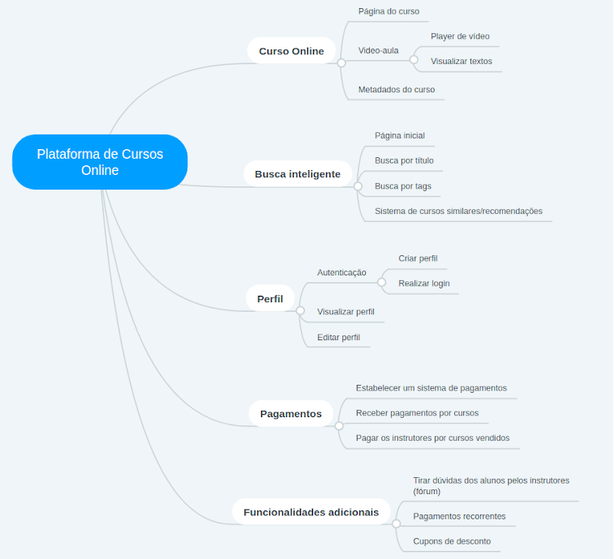
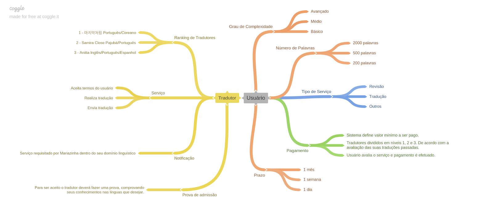
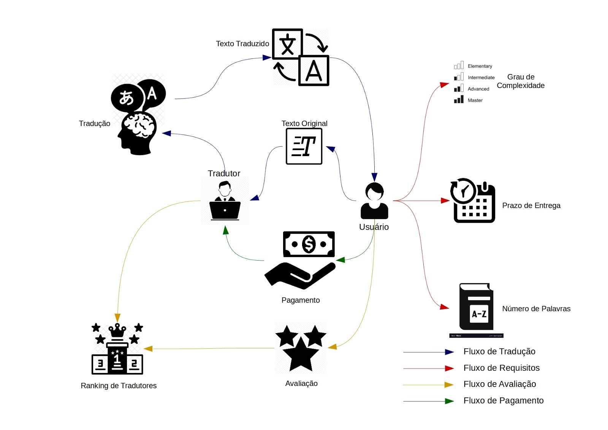

## Histórico de Revisão:
| Data | Versão | Descrição | Autor |
|---|---|---|---|
|12/04/2019|1.0|Primeira versão do documento|Gabriela Guedes|

## Definição do Tema do Projeto
Inicialmente foram elaboradas várias propostas de possíveis temas, sendo elas:

* Plataforma de marketplace de video aulas;
* Crawler para mineração de dados;
* Webapp que fornece serviços de tradução de artigos;

## Artefatos

Para um melhor entendimento dos temas propostos foi elaborado artefatos para cada um deles.

### Marketplace de Video Aulas

#### Mapas Mentais:

#### Rich Picture:

### Crawler para Mineração de Dados

#### 5W2H:
1. What ?
	* O produto a ser feito é um marketplace que venderá dados que serão gerados através de um crawler ou, como é dito no meio de DataScience, será feito um data mining.
	* O produto também vai funcionar como um sistema de requisições de dados, ou seja, conforme a necessidade dos clientes que usaram o site, um crawler específico será feito para aquela pessoa caso seja assindo o pacote premium do site. 
2. When ?
	* Tudo será produzido no tempo da disciplina, de no mínimo um MVP do escopo feito no começo do semestre e o máximo de entrega final dos seminários ao final da matéria, sendo este o prazo total de produção. 
3. Who ?
	* Todo o serviço será feito pelo grupo que foi determinado no começo da matéria.
4. Where ?
	* Todo o trabalho será feito na UnB, campus do Gama, nos locais predeterminados pelo grupo, nos pareamentos e nas reuniões.

5. Why?
	* Esse produto será feito graças a uma necessidade em obter dados para aprendizado de máquina e estudos de mercados no geral, relatados em artigos como:   

    |Tipo|Assunto|Link|
    |	---	| ---	 | --- |
    |Fórum|O que é mais importante? Bons dados ou Bons algoritmos?|https://www.quora.com/Is-good-data-or-good-algorithm-more-important-in-machine-learning
    |Artigo| Desmitificando aprendizado de máquina: A importancia de dados|https://www.quora.com/Is-good-data-or-good-algorithm-more-important-in-machine-learning|
    |Artigo| A importancia da coleta de dados para seu negócio|https://www.simplybusiness.co.uk/knowledge/articles/2010/06/2010-06-03-why-marketing-data-is-important-to-a-growing-business/|
    |Artigo Científico|Reality Check: Combinando Experiências de Escolha com Dados de Mercado para Estimar a Importância dos Atributos do Produto.|https://pubsonline.informs.org/doi/pdf/10.1287/mnsc.1090.1136|
    |Artigo científico|Sistemas e métodos para aprendizado de máquina e gerenciamento de dados|https://patentimages.storage.googleapis.com/21/3d/63/eaa0b260547816/US6845340.pdf|
    |Artigo científico|Tecnicas de aprendizado de máquina para mineração de dados: A pesquisa|https://ieeexplore.ieee.org/abstract/document/6724149/|

6. How ?
	* Esse produto será feito em django e react com banco de dados não relacional. Terá um estudo de requistos dentro de mercado, o qual será exposto pelo grupo, como dispor os dados da melhor maneira para os pesquisadores e as empresas que os necessitem para a realização e desenvolvimento de suas próprias pesquisas internas.
	* Será usado um método misto para o gerenciamento da equipe usando documentos essenciais do RUP, gerenciamento do scrum, algumas documentações e estilo de pareamento do extreme programing.

7. How much?
	* A precificação será realizada após a escolha do tema do grupo.

#### Protótipo:

### Plataforma para Traduções de Artigos
#### Mapa Mental:

#### Rich Pictures:

## Decisões:
**Estrutura:** De acordo com os conhecimentos gerais do grupo e as afinidades da maioria com determinadas linguagens e frameworks, optamos por um projeto utilizando as linguagens JavaScript e Python.

**Tema:** Com todas as ideias apresentadas, realizamos uma votação que buscava enfim decidir qual projeto seria o executado no decorrer da disciplina.

Assim, o tema escolhido foi o da **Plataforma para Tradução de Artigos**

## Organização

* O sistema de tradução será feito em forma de WebApp, com o front-end em React e o back-end em Django

* Uso de banco de dados não relacional MongoDB

* A metodologia adotada será um compilado da Ágil, XP e RUP. Onde usaremos documentos essenciais do RUP, gerenciamento SCRUM e o estilo de pareamento do Extreme Programing, trazendo para o planejamento, o uso de quadro de horários, sprint review e planning e documentação de código

* O grupo optou também pelo uso do Git Hub, Git Lab para CI e  sistema de branches para o uso do Git: master, devel e features

* Uso do Docker
