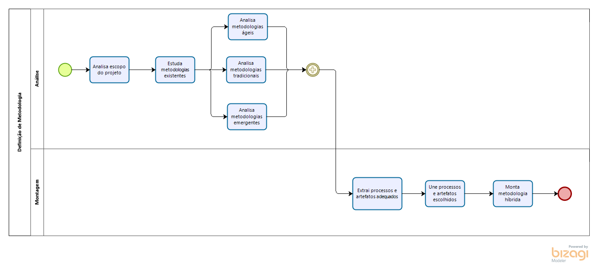
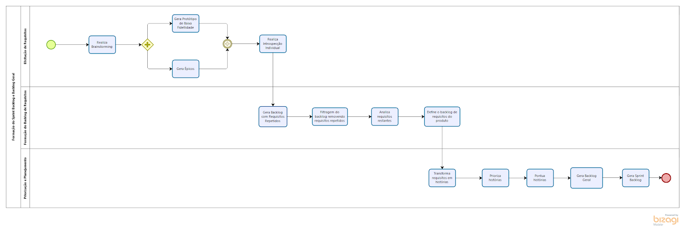
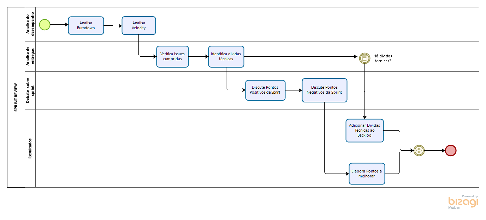
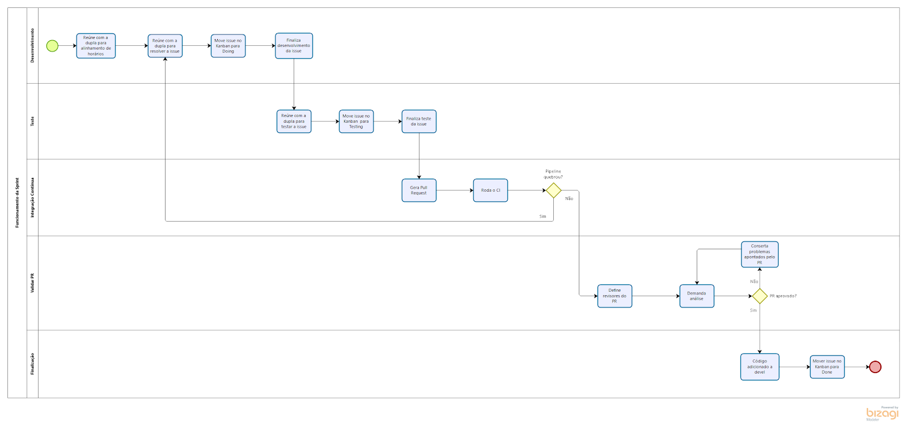

## Histórico de Revisão:
| Data | Versão | Descrição | Autor |
|---|---|---|---|
|12/04/2019 | 0.1 | Primeira versão do documento | Gabriela Guedes |
|12/04/2019 | 0.2 | Inclusão dos diagramas modelados em Bizagi | Todos os Integrantes do Grupo |
|27/04/2019 | 0.3 | Refatoração dos diagramas incluindo artefatos | Renan Schadt |
|29/04/2019 | 0.4 | Inclusão dos tópicos 2 e 3 | Renan Schadt |
 
## 1. Introdução
Este documento tem por finalidade definir a metodologia a ser utilizada no projeto, mostrando através dos diagramas feitos no Bizagi, as rotinas e artefatos da equipe até a finalização do desenvolvimento.

## 2. Metodologias de Base
### 2.1 Scrum
O Scrum é uma metodologia ágil que contém diversas rotinas para manter a equipe engajada e atualizada sobre o projeto, a se organizarem enquanto resolvem um problema e a refletirem sobre os êxitos e fracassos para melhorarem continuamente. Scrum é um framework estrutural usado para gerenciar o desenvolvimento de produtos. Ele é fundado nos princípios de transparência, inspeção e adaptação. Aos princípios do Scrum integramos eventos, papéis e artefatos, administrando as relações e interações entre eles.

Os papéis do Scrum são Product Owner, Scrum Master e time de desenvolvimento. O Product Owner é o responsável por maximizar o valor do produto e gerenciar o Product Backlog, garantindo que ele está claro para toda equipe. O Scrum Master tem a função de garantir que a equipe está cumprindo as regras da metodologia. O time de desenvolvimento, tem a função de incrementar o produto a cada sprint.

Os eventos do Scrum são: Sprint (período de um mês ou menos onde a equipe se dedica a incrementar o produto), Planejamento de Sprint (reunião ao início de cada sprint onde a equipe decide o que será feito nesta), Review e Retrospectiva da Sprint (a equipe analisa como foi a sprint e quais atividades atividades e artefatos alocados a ela foram finalizados) e Daily (reunião diária para alinhamento da equipe sobre o andamento da sprint).

Os artefatos do Scrum são: Product Backlog (lista ordenada de tudo que é necessário no produto), Sprint Backlog (conjunto de itens do backlog do produto selecionados para a sprint) e Incremento (soma de todos os itens do backlog do produto completados durante uma sprint).

### 2.2 Kanban
O Kanban, trata-se de uma simbologia visual usada no desenvolvimento de produtos para registrar o progresso das atividades. Essa metodologia foi criada pela empresa Toyota e integra o famoso sistema Toyota de produção.

O Kanban é orientado através de colunas, em que cada uma representa diferentes estados de completeza de uma atividade (a fazer, fazendo, feito), as atividades (cartões visuais) vão transitando entre as colunas, mostrando o andamento do projeto. 

### 2.3 XP
XP é um apelido carinhoso de uma nova metodologia de desenvolvimento designada Extreme Programming, com foco em agilidade de equipes e qualidade de projetos, apoiada em valores como simplicidade, comunicação e feedback constante.

Extreme Programming é dinâmica e flexível, entre as suas "boas práticas" é possível citar: TDD, Comentários em código, diversas entregas pequenas, programação em pares, testes de aceitação, planejamento por pontos, refatoramento, presença constante do cliente, integração contínua, entre outros.

### 2.4 RUP

## 3. Metodologia Montada
A metodologia adotada no projeto foi uma híbrida, baseada nas metodologias Scrum, Kanban, XP e RUP.
Decidimos utilizar uma metodologia híbrida, pois nenhuma das metodologias puristas se encaixava em nosso contexto. Seja pelo excesso de documentação, no caso do RUP; excesso de rotinas, no caso do Scrum; ou pela falta destas, no caso do XP e Kanban.

## 4. Diagramas

### 4.1 Funcionamento Geral

### 4.2 Processo de Decisão de Tema

### 4.3 Processo Decisão de Metodologia

### 4.4 Processo Decisão de Tecnologia

### 4.5 Definição do Backlog

### 4.6 Documentação

### 4.7 Sprint Review

### 4.8 Sprint Planning

### 4.9 Funcionamento da Sprint

### 4.10 Acompanhamento da Sprint

### 4.11 Ponto de Controle

## 5.0 Referências
 * [Guia do Scrum](https://www.scrumguides.org/docs/scrumguide/v1/Scrum-Guide-Portuguese-BR.pdf)