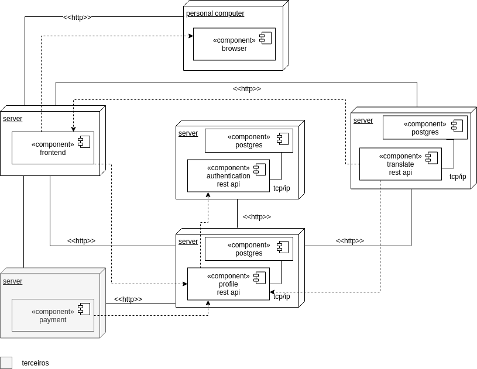
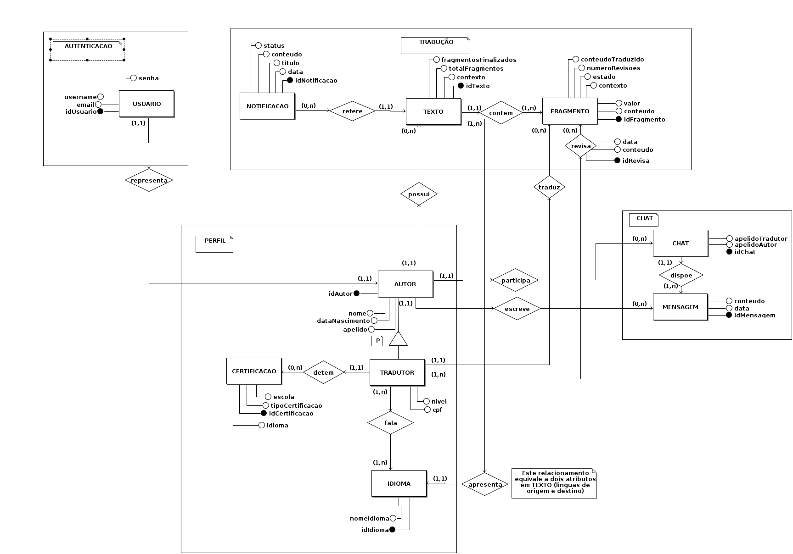

# Documento de Arquitetura

## Histórico de Revisão:
| Data | Versão | Descrição | Autor |
|---|---|---|---|
| 31/03/2019 | 0.1 | Adicionando o Template do documento de arquitetura | Victor Hugo |
| 01/04/2019 | 0.2 | Modificando Template para preenchimento | Alexandre Miguel|
| 09/04/2019 | 0.3 | Adicionando Definições, Acrônimos e Abreviações  | Letícia Meneses |
| 09/04/2019 | 0.4 | Adicionando Introdução e Requisitos e Restrições arquiteturais | Gabriela Guedes |
| 10/04/2019 | 0.5 | Adicionando informações de Dimensionamento e Performance e de Qualidade  | Alexandre Miguel |
| 11/04/2019 | 0.6 | Adicionando escopo do projeto  | Helena Goulart  |
| 11/04/2019 | 0.7 | Adicionando Diagrama de Classes | Rômulo Souza |
| 11/04/2019 | 0.8 | Adicionando o diagrama de implementação | Victor Hugo |
| 11/04/2019 | 0.9 | Adicionando finalidade do documento | João Robson |
| 22/04/2019 | 0.9.1 | Revisando e Adicionando Descrições de Tópicos  | Alexandre Miguel |
| 27/04/2019 | 1.0 | Adicionando informações do Banco de Dados  | Alexandre Miguel e Rômulo Souza |
| 15/06/2019 | 1.1 | Adicionando segunda versão do diagrama de classes  | Letícia Meneses e Gabriela Guedes |
| 16/06/2019 | 1.2 | Adicionado sub tópicos em visão geral de camadas e pacotes| Davi Alves |
|23/06/2019|1.3|Adicionado nova versão do diagrama de micro serviços| Victor Hugo|
|23/06/2019|1.4|Adicionado nova versão do diagrama de implementação e ajustando erros de ortografia| Victor Hugo|

## Objetivo do Documento
Este documento tem como objetivo descrever e caracterizar as decisões arquiteturais do projeto
**Translate.me** . A caraterização será feita com enfoque no âmbito do software, não levando em conta medições como de performance.

## 1. Introdução
Este documento visa apresentar a arquitetura de software a ser aplicada no sistema do **Translate.me** , de forma que facilite a visualização dos requisitos e da estrutura para os envolvidos.

### 1.1. Finalidade

Este documento apresenta os aspectos arquiteturais do projeto, exibindo como se dará a integração entre os micros serviços que compõem o *Back-end* e o *Front-end* . Dessa forma, ele é composto não só de diagramas e abordagens abstratas, mas também de uma visão que trata das tecnologias envolvidas na elaboração do projeto e da forma na qual esses elementos serão incorporados para se obter os requisitos funcionais e não funcionais propostos.

---
### 1.2. Escopo
Este documento de arquitetura se aplica ao **Translate.me** , aplicação desenvolvida na disciplina Arquitetura e Desenho de Software.

### 1.3. Definições, Acrônimos e Abreviações

 **UnB** - Universidade de Brasília

 **FGA** - Faculdade do Gama

 **Translate.me** - WebApp com finalidade em tradução de textos, ligando tradutor e cliente.

 **Backend** - Parte da aplicação responsável pelo gerenciamento de recursos a serem utilizados no Frontend.

 **Frontend** - Parte da aplicação responsável pelo contato com o usuário, consumindo recursos do Backend.

### 1.4. Referências
[Lino](https://botlino.github.io/docs/doc-arquitetura) - Documentação de arquitetura do projeto de Bot em desenvolvimento na FGA

[Design Patterns](https://refactoring.guru/design-patterns) - Padrões de Design aplicados ao desenvolvimento de software

---

## 2. Representação Arquitetural

Modelo de representação dos serviços implementados e as interações estabelecidas entre esses serviços, bem como a natureza dessas interações.

### 2.1 Diagrama de arquitetura

#### Versão 1   

#### versão 2   

__OBS:__ Foi visto a necessidade de mudar a arquitetura do projeto, pois descartamos a parte de chat dentro do escopo da disciplina
 e para aumentar a reutilização de alguns do serviços para vários tipos de projeto foi necessário que o serviço de autenticação fosse
 separado em dois micro serviços. Em que o serviço de profile é responsável pelos tipos de perfis que terão na aplicação e o authentication
 é responsável pela parte de usuário, senha e token dentro das aplicações.  

#### Papeis:

* __React__: responsável pela parte do frontend da aplicação.

* __Translate__: responsável pela parte de manipulação dos textos, fragmentos, traduções e revisões dentro da aplicação.

* __Payment__: responsável pela parte de repasse do dinheiro da carteira virtual do autor do texto para o tradutor do texto. 

* __Authentication__: responsável pela parte de autentificação dentro da aplicação bem como cadastro de usuário, senha e atribuição de token de autenticação
para o usuário em questão.

* __Profile__: responsável por cadastro dos tipos de perfis dentro da aplicação, sendo esses tradutor e autor.
 
---

## 3. Requisitos e Restrições Arquiteturais

|Requisito|Solução|
|---|---|
|Linguagem|O front-end será feito em *JavaScript* e o back-end, em *Python*.|
|Plataforma|Serão usadas as plataformas *ReactJS* para o front-end e *Django* para o back-end. |
|Segurança| É necessário uma segurança para com os dados, pois todos os usuários irão interagir de forma anônima. Para uma maior segurança das informações, será necessário a utilização de token nas requisições. |
|Persistência|O sistema lidará com uma quantidade grande de dados (informações de usuário e textos em tradução), que para um bom funcionamento do sistema não podem ser perdidos, para a persistência destes dados será utilizado um banco de dados relacional *PostgreSQL* .|
|Arquitetura|Será feita uma arquitetura de microsserviços, para um melhor funcionamento e desempenho do sistema, já que não serão dependentes entre si|

---
## 4. Visão Lógica

Modelagens conforme padrão UML que representam os aspectos arquiteturais do sistema, como as classes utilizadas, as camadas e pacotes da aplicação e a visão da implementação de cada serviço.

### 4.1 Diagrama de Classes
#### Versão 1.0

#### Versão 2.0

### 4.2. Visão Geral de Camadas e Pacotes

#### 4.2.1
React(Front-End) - Biblioteca JavaScript que leva consigo outros 3 pacotes que são:

* Redux - Facilitador da comunicação entre componentes sem acoplá-los.
* Telas - Telas propriamente ditas onde o usuário estará interagindo, ela depende do redux e dos componentes.
* Componentes - Os componentes permitem que você divida sua interface em partes independentes e reutilizáveis, e que você pense em cada parte de forma isolada.
#### 4.2.2
Django(Back-End) - Framework Web que segue o padrão arquitetural model-template-view que possui os pacotes:

* Autenticação - Manipula contas de usuário, grupos, permissões e sessões de usuário.

  * Login - Possui todas  as funções de autenticador de usuário e depende do cadastro.
  * Cadastro - Possui funções para criação de novos usuários.
* Tradução - Possui todas  as funções relacionadas a tradução que sera feita por um tipo especifico de usuário. Ela depende diretamente da autenticação e do pagamento.
* Pagamento - Possui todas  as funções relacionadas ao pagamento que será efetuado e também recebido, dependente da autenticação.
* Chat - Dependente da tradução para comunicação dos usuários, possui funções para troca de mensagens.
* Gamificação - Possui funções para melhoria de interação do usuário e depende apenas do pacote tradução.
#### 4.2.3

* Base de Dados - O pacote Base de dados inclui todas funções necessarias para suportar o armazenamento dos dados.

---
## 5. Visão de implementação
### 5.1 Diagrama de implementação
Diagrama de implementação serve para dar uma visão de como seria implementado em hardware a arquitetura proposta. Visto que nela é possível ver a quantidade de servidores e/ou serviços por servidores
 , máquinas pessoais e protocolos de comunicação. 

#### Versão 1

#### Versão 2

__OBS__: Foi retirada a parte de chat da aplicação visto que por conta do tempo e da complexidade que levaria para implementar esse micro serviço não daria para entregar no escopo da matéria.

---
## 6. Dimensionamento e Performance

Seção responsável pela estimativa em valores quantizados do desempenho dos módulos da arquitetura, bem como de sua performance em execução, conforme a análise qualitativa estabelecida no [Documento de Requisitos Não Funcionais](../../../requisitos/modelagem/nfr).

### 6.1. Volume   
De forma geral, o sistema deve permitir que o fluxo de usuários de ambos os tipos tenham acesso, otimizando acessos de usuários autores para velocidade enquanto dispõe de uma quantidade maior de acessos a usuários tradutores, que representam maior tempo de atividade e em maior número de acesso aos sistemas, com uma escala 1 : 4 em termos de autores e tradutores. Assim, é possível montar a seguinte tabela de estimativas para volumes, traçando paralelos entre usuários tradutores e usuários autores.

| **-** | Autores | Tradutores | Total |
| --- | --- | --- | --- |
| **Número de Usuários** | 400 | 1600 | 2000|
| **Número de Acessos Diários por usuário** | 1 - 5 | 7 - 15 | 8 - 20|
| **Tempo de Sessão de Usuário** |15 - 50 minutos | 50 minutos - 1 hora e 20 minutos | 33 minutos - 1 hora |

### 6.2. Performance

Para o correto funcionamento do sistema, a performance deve ser rápida e com a conclusão de funcionalidades como o *upload* de textos em até 1 minuto, para textos com mais de 200 páginas, bem como respostas eficientes da utilização de sistemas como a separação de fragmentos e o envio do texto para tradução.

---
## 7. Qualidade

Os seguintes itens conferem ao sistema aspectos de qualidade, bem como a descrição da abordagem realizada para satisfazer esses aspectos.

| Item | Solução | Descrição |
| --- | --- | --- |
| **Escalabilidade** | Arquitetura de Micros serviços | Em prol de permitir que o sistema evolua sem grandes gargalos, o sistema de modularização aplicado pela arquitetura de micros serviços propicia alterações no funcionamento de um serviço sem alterações em grande escala nos demais serviços relacionados, permitindo modificações mais pontuais e uma integração facilitada do sistema. |
| **Confiabilidade** | Manutenção Periódica e Modularização do Sistema | Pela modularização do sistema permitir menor impacto de um micros serviço no funcionamento de outro, a prática de manutenções periódicas permite a solução de problemas de forma pontual e sem impedir o funcionamento de demais serviços, ao contrário de abordagens monolíticas |
| **Segurança** | Encriptação de dados e Servidor Remoto | Para garantir a segurança de informações sensíveis, a abordagem utilizada será a encriptação de dados e utilização de Hashes, permitindo que informações puras não trafeguem por mais módulos da aplicação do que o necessário, armazenando-as no servidor remoto e acessando-as por meio das hashes.  |
| **Portabilidade** | Arquitetura de Micros serviços | A Utilização da arquitetura de micros serviços permite o desenvolvimento do Backend da aplicação desacoplado do Frontend, permitindo então que esse Frontend seja adaptado para diferentes plataformas, com um funcionamento equivalente conforme o que foi implementado no Backend, contando ainda com a independência de funcionamento de cada serviço. |  

## 8. Banco de Dados

### 8.1. Modelo Entidade - Relacionamento (ME-R)

  Dada a arquitetura do projeto, modularizada por microsserviços, as entidades se referem ao que será requerido e utilizado em cada módulo

#### 8.1.1. Entidades e Atributos

##### Certificação

* CERTIFICACAO (idCertificacao , idioma, escola, tipoCertificacao)

##### Autenticação

* AUTOR (idAutor , cpf, nome, apelido, email, senha)

* TRADUTOR (idAutor, idTradutor , cpf, nome, apelido, email, senha, nivel, {lingua})

##### Tradução

* TEXTO (idTexto , contexto, linguaOrigem , linguaDestino)

* FRAGMENTO (idFragmento , contexto, linguaOrigem , linguaDestino, conteudo, valor)

##### Chat

* CHAT (idChat , apelidoTradutor, apelidoAutor)

* FRAGMENTO (idMessage , conteudo, data)

#### 8.1.2. Relacionamentos

#### 8.1.2.1 Versão 1

* **TRADUTOR -** ***detem*** **- CERTIFICACAO**  
Um tradutor detêm nenhuma ou várias certificações, mas cada certificação é detida somente por um tradutor.  
Cardinalidade: **1:n**

* **AUTOR -** ***participa*** **- CHAT**   
Um autor participa de nenhum ou de vários chats, mas cada chat possui um único autor.  
Cardinalidade: **1:n**

* **AUTOR -** ***escreve*** **- CHAT**    
Um autor escreve nenhuma ou várias mensagens, mas cada mensagem é escrita por somente um autor.
Cardinalidade: **1:n**

* **TRADUTOR -** ***traduz*** **- FRAGMENTO**    
Um tradutor pode traduzir nenhum ou vários fragmentos, mas cada fragmento é traduzido por somente um tradutor.
Cardinalidade: **1:n**

* **TEXTO -** ***contem*** **- FRAGMENTO**    
Um texto contém um ou vários fragmentos, e cada fragmento está contido em um único texto.
Cardinalidade: **1:n**

* **AUTOR -** ***possui*** **- TEXTO**    
Um autor possui nenhum ou vários textos, mas cada texto é possuído por um único autor.
Cardinalidade: **1:n**

### 8.3. Diagrama Entidade - Relacionamento (DE-R)

#### 8.3.1 Versão 2

Adição do serviço de Línguas

#### 8.3.1 Versão 3

Adição da entidade de Notificação e remoção do serviço de Línguas

