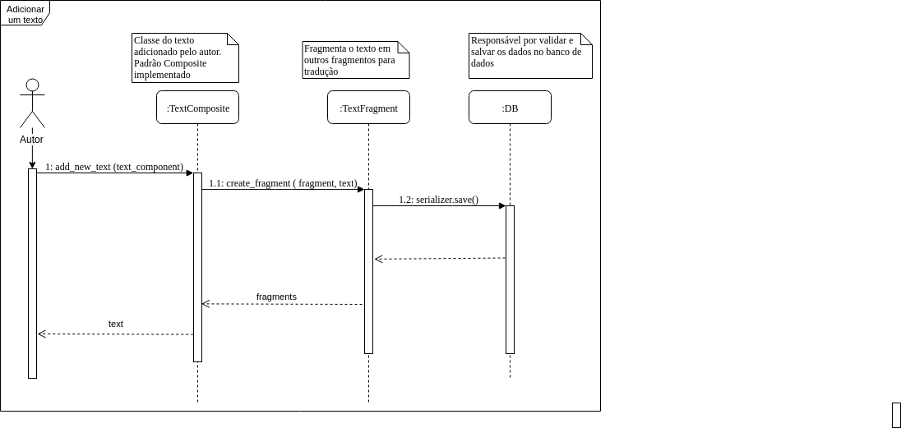
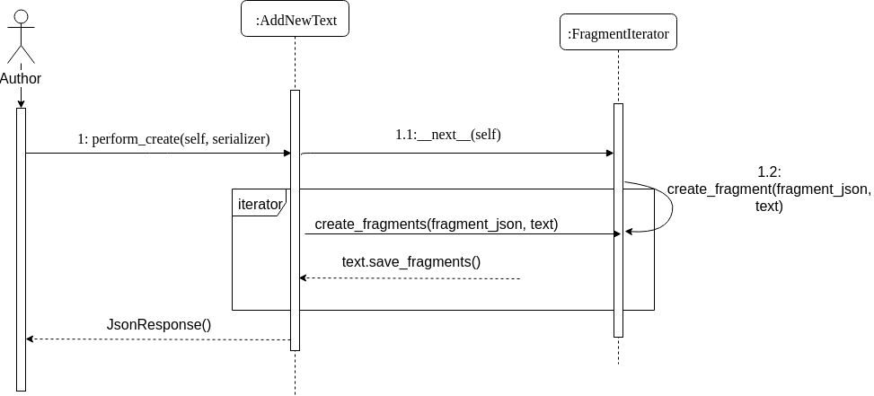

# Documento de Arquitetura

## Histórico de Revisão:
| Data | Versão | Descrição | Autor |
|---|---|---|---|
| 31/03/2019 | 0.1 | Adicionando o Template do documento de arquitetura | Victor Hugo |
| 01/04/2019 | 0.2 | Modificando Template para preenchimento | Alexandre Miguel|
| 09/04/2019 | 0.3 | Adicionando Definições, Acrônimos e Abreviações  | Letícia Meneses |
| 09/04/2019 | 0.4 | Adicionando Introdução e Requisitos e Restrições arquiteturais | Gabriela Guedes |
| 10/04/2019 | 0.5 | Adicionando informações de Dimensionamento e Performance e de Qualidade  | Alexandre Miguel |
| 11/04/2019 | 0.6 | Adicionando escopo do projeto  | Helena Goulart  |
| 11/04/2019 | 0.7 | Adicionando Diagrama de Classes | Rômulo Souza |
| 11/04/2019 | 0.8 | Adicionando o diagrama de implementação | Victor Hugo |
| 11/04/2019 | 0.9 | Adicionando finalidade do documento | João Robson |
| 22/04/2019 | 0.9.1 | Revisando e Adicionando Descrições de Tópicos  | Alexandre Miguel |
| 27/04/2019 | 1.0 | Adicionando informações do Banco de Dados  | Alexandre Miguel e Rômulo Souza |
| 15/06/2019 | 1.1 | Adicionando segunda versão do diagrama de classes  | Letícia Meneses e Gabriela Guedes |
| 16/06/2019 | 1.2 | Adicionado sub tópicos em visão geral de camadas e pacotes| Davi Alves |
| 23/06/2019 | 1.3 |Adicionado nova versão do diagrama de micro serviços| Victor Hugo|
| 23/06/2019 | 1.4 |Adicionado nova versão do diagrama de implementação e ajustando erros de ortografia| Victor Hugo|
| 23/06/2019 | 1.5 |Adicionado análise do GQM | Gabriela Guedes e Helena Goulart|
| 23/06/2019 | 1.6 | Adicionado novo diagrama de pacotes e subtopicos em visão geral de camadas e pacotes| Davi Alves |
| 23/06/2019 | 1.7 | Adicionando versões 2 e 3 do ME-R e DE-R na visão de dados | Alexandre Miguel|
| 23/06/2019 | 1.8 | Adicionando a quarta versão do Diagrama Entidade-Relacionamento | Alexandre Miguel |
| 23/06/2019 | 1.9 | Adicionando diagrama de sequência do autor | Letícia Meneses |
| 30/06/2019 | 2.0 | Adicionando versão 3 do diagramade classes e de sequenciaas de padrões aplicados | Letícia Meneses |

## Objetivo do Documento
Este documento tem como objetivo descrever e caracterizar as decisões arquiteturais do projeto
**Translate.me** . A caraterização será feita com enfoque no âmbito do software, não levando em conta medições como de desempenho.

---

## 1. Introdução
Este documento visa apresentar a arquitetura de software a ser aplicada no sistema do **Translate.me** , de forma que facilite a visualização dos requisitos e da estrutura para os envolvidos.

### 1.1. Finalidade

Este documento apresenta os aspectos arquiteturais do projeto, exibindo como se dará a integração entre os micros serviços que compõem o *Back-end* e o *Front-end* . Dessa forma, ele é composto não só de diagramas e abordagens abstratas, mas também de uma visão que trata das tecnologias envolvidas na elaboração do projeto e da forma na qual esses elementos serão incorporados para se obter os requisitos funcionais e não funcionais propostos.

### 1.2. Escopo
Este documento de arquitetura se aplica ao **Translate.me** , aplicação desenvolvida na disciplina Arquitetura e Desenho de Software.

### 1.3. Definições, Acrônimos e Abreviações

 **UnB** - Universidade de Brasília

 **FGA** - Faculdade do Gama

 **Translate.me** - WebApp com finalidade em tradução de textos, ligando tradutor e cliente.

 **Backend** - Parte da aplicação responsável pelo gerenciamento de recursos a serem utilizados no Frontend.

 **Frontend** - Parte da aplicação responsável pelo contato com o usuário, consumindo recursos do Backend.

### 1.4. Referências
[Lino](https://botlino.github.io/docs/doc-arquitetura) - Documentação de arquitetura do projeto de Bot em desenvolvimento na FGA

[Design Patterns](https://refactoring.guru/design-patterns) - Padrões de Design aplicados ao desenvolvimento de software

[Academia Brasileira de Ciências](http://www.abc.org.br/2019/04/15/universidades-publicas-respondem-por-mais-de-95-da-producao-cientifica-do-brasil/#)

[UnB](https://noticias.unb.br/117-pesquisa/2267-impacto-da-producao-cientifica-da-unb-aumenta-mais-de-100-em-seis-anos)

[American Journal Express](https://www.aje.com/br/services/translation/?gclid=Cj0KCQjw6cHoBRDdARIsADiTTzZqBOuLFXdYDU2oG5EDX1UaTY3INQwXxklQgy_k1loXJtpIVf_fm20aAiOUEALw_wcB)
[ME-R e  DE-R](https://www.devmedia.com.br/modelo-entidade-relacionamento-mer-e-diagrama-entidade-relacionamento-der/14332) - Definição de Aspectos do Modelo Entidade - Relacionamento e Diagramação associada

[Notação do Modelo Entidade-Relacionamento](https://www.lucidchart.com/pages/pt/simbolos-de-diagramas-entidade-relacionamento) - Notações utilizadas na descrição e diagramação do Modelo Entidade Relacionamento

ELMASRI, R. e NAVATHE, S. B., Sistema de Banco de Dados, 4ª edição, 2005.

---

## 2. Representação Arquitetural

Modelo de representação dos serviços implementados e as interações estabelecidas entre esses serviços, bem como a natureza dessas interações.

### 2.1 Diagrama de arquitetura

#### Versão 1   

#### versão 2   

__OBS:__ Foi visto a necessidade de mudar a arquitetura do projeto, pois descartamos a parte de chat dentro do escopo da disciplina
 e para aumentar a reutilização de alguns do serviços para vários tipos de projeto foi necessário que o serviço de autenticação fosse
 separado em dois micro serviços. Em que o serviço de profile é responsável pelos tipos de perfis que terão na aplicação e o authentication
 é responsável pela parte de usuário, senha e token dentro das aplicações.  

#### Papeis:

* __React__: responsável pela parte do frontend da aplicação.

* __Translate__: responsável pela parte de manipulação dos textos, fragmentos, traduções e revisões dentro da aplicação.

* __Payment__: responsável pela parte de repasse do dinheiro da carteira virtual do autor do texto para o tradutor do texto.

* __Authentication__: responsável pela parte de autentificação dentro da aplicação bem como cadastro de usuário, senha e atribuição de token de autenticação
para o usuário em questão.

* __Profile__: responsável por cadastro dos tipos de perfis dentro da aplicação, sendo esses tradutor e autor.

---

## 3. Requisitos e Restrições Arquiteturais

|Requisito|Solução|
|---|---|
|Linguagem|O front-end será feito em *JavaScript* e o back-end, em *Python*.|
|Plataforma|Serão usadas as plataformas *ReactJS* para o front-end e *Django* para o back-end. |
|Segurança| É necessário uma segurança para com os dados, pois todos os usuários irão interagir de forma anônima. Para uma maior segurança das informações, será necessário a utilização de token nas requisições. |
|Persistência|O sistema lidará com uma quantidade grande de dados (informações de usuário e textos em tradução), que para um bom funcionamento do sistema não podem ser perdidos, para a persistência destes dados será utilizado um banco de dados relacional *PostgreSQL* .|
|Arquitetura|Será feita uma arquitetura de microsserviços, para um melhor funcionamento e desempenho do sistema, já que não serão dependentes entre si|

---
## 4. Visão Lógica

Modelagens conforme padrão UML que representam os aspectos arquiteturais do sistema, como as classes utilizadas, as camadas e pacotes da aplicação e a visão da implementação de cada serviço.

### 4.1 Diagrama de Classes
#### Versão 1.0

#### Versão 2.0

#### Versão 3.0

### 4.2. Visão Geral de Camadas e Pacotes
#### Versão 1.0

#### Versão 2.0

#### 4.2.1 Camada UI
React - Biblioteca JavaScript que leva consigo outros 3 pacotes que são:

* Redux - Facilitador da comunicação entre componentes sem acoplá-los.
* Telas - Telas propriamente ditas onde o usuario estará interagindo, ela depende do redux e dos componentes.
* Componentes - Os componentes permitem que você divida sua interface em partes independentes e reutilizáveis, e que você pense em cada parte de forma isolada.

#### 4.2.2 Camada Back-End
Django - Framework Web que segue o padrão arquitetural model-template-view que possui os pacotes:

* Autenticação - Manipula contas de usuário, grupos, permissões e sessões de usuário.

  * Login - Possui todas  as funções de autenticador de usuario e depende do cadastro.
  * Cadastro - Possui funções para criação de novos usuarios.

* Usuário - Possui uma generalização de tipos de usuário
  * Autor - Responsavel por submeter o texto para tradução
  * Tradutor - Responsavel por traduzir o texto submetido
  * Revisor - Responsavel por revisar o texto que ja foi traduzido e ainda dar feedbaks para o autor.

* Serviços Translate-me

  * Submissão - Possui todas funções para que o usuario possa submeter o seu texto para a tradução. Ela depende diretamente da autenticação.
  * Tradução - Possui todas  as funções relacionadas a tradução que sera feita por um tipo especifico de usuario. Ela depende diretamente da autenticação.
  * Revisão - Possui todas as funções para que o revisor possa revisar e gerar os feedbacks de como estáo texto.
  * Pagamento - Possui todas  as funções relacionadas ao pagamento que será efetuado e também recebido, dependente da autenticação.
  * Gamificação - Possui funções para melhoria de interação do usuario e depende apenas do pacote tradução.

#### 4.2.3 Base de Dados
Base de Dados - O pacote Base de dados inclui todas funções necessarias para suportar o armazenamento dos dados.

### 4.3 Diagrama de Sequência
O diagrama de sequência tem por finalidade demonstrar a sequência das mensagens entre objetos em uma interação.

#### 4.3.1 Adiconar um Texto (Autor)

#### 4.3.2 Adicionar um Texto - Visão do Padrão **Iterator**

#### 4.3.3 Adicionar um Texto - Visão do Padrão **Composite**

---
## 5. Visão de implementação
### 5.1 Diagrama de implementação
Diagrama de implementação serve para dar uma visão de como seria implementado em hardware a arquitetura proposta. Visto que nela é possível ver a quantidade de servidores e/ou serviços por servidores
 , máquinas pessoais e protocolos de comunicação.

#### Versão 1

#### Versão 2

__OBS__: Foi retirada a parte de chat da aplicação visto que por conta do tempo e da complexidade que levaria para implementar esse micro serviço não daria para entregar no escopo da matéria.

---
## 6. Dimensionamento e Desempenho

Seção responsável pela estimativa em valores quantizados do desempenho dos módulos da arquitetura, bem como de sua desempenho em execução, conforme a análise qualitativa estabelecida no [Documento de Requisitos Não Funcionais](../../../requisitos/modelagem/nfr).

### 6.1. Volume   
O sistema deve permitir que o fluxo de usuários de ambos os tipos tenham acesso a aplicação e suas funcionalidades. Os usuários autores somente usam a plataforma para submeter um novo texto ou acompanhar o status de um texto enviado, é um uso baixo e inconstante desta. Já os usuários tradutores, representam maior tempo de atividade e um acesso constante ao sistema.

Para dimensionar o volume de utilização do software faremos uma estimativa mantendo como foco a produção acadêmica realizada na Universidade de Brasília, visto que nosso software inicialmente será direcionado ao público desta. De acordo com a própria UnB, utilizando dados do SciVal, um software desenvolvido pela editora científica Elsevier para a gestão estratégica da pesquisa, cerca de 2000 artigos foram adicionados a base científica Scopus no ano de 2016, considerando a crescente da produção científica vista nos anos de 2011 a 2016 na UnB, podemos estimar que a Universidade atualmente adiciona cerca de 2500 a 3000 artigos na Scopus anualmente.

Através da análise dos prazos de plataformas concorrentes, consideramos que os tradutores levam em torno de duas semanas para traduzir e revisar um artigo contendo até 15 páginas. Na plataforma proposta os prazos se mantém, visto que não há alteração na produtividade dos tradutores.

Através dos dados acima referentes a produtividade dos tradutores e número de artigos produzidos pela UnB, podemos concluir que para manter a plataforma funcionando corretamente serão necessários no mínimo 200 tradutores. É possível chegar a esse resultado obtendo a média de artigos produzidos a cada duas semanas (=~100), multiplicado pelo número de envolvidos em cada tradução (2 - Tradutor e Revisor), reiterando que é possível obter essa estimativa pois a produtividade dos tradutores/revisores não muda na nossa plataforma, comparada as demais concorrentes.

É possível fazer um escalonamento destes dados para englobar a produção científica em contexto nacional, de forma que seria necessária a busca por novos tradutores, para que seja possível atender a demanda crescente.

### 6.2. Desempenho

Para o correto funcionamento do sistema, o desempenho deve ser rápida e com a conclusão de funcionalidades como o *upload* de textos em até 1 minuto, para textos com mais de 200 páginas, bem como respostas eficientes da utilização de sistemas como a separação de fragmentos e o envio do texto para tradução.

---
## 7. Qualidade

Os seguintes itens conferem ao sistema aspectos de qualidade, bem como a descrição da abordagem realizada para satisfazer esses aspectos.

| Item | Solução | Descrição |
| --- | --- | --- |
| **Escalabilidade** | Arquitetura de Micros serviços | Em prol de permitir que o sistema evolua sem grandes gargalos, o sistema de modularização aplicado pela arquitetura de micros serviços propicia alterações no funcionamento de um serviço sem alterações em grande escala nos demais serviços relacionados, permitindo modificações mais pontuais e uma integração facilitada do sistema. |
| **Confiabilidade** | Manutenção Periódica e Modularização do Sistema | Pela modularização do sistema permitir menor impacto de um micros serviço no funcionamento de outro, a prática de manutenções periódicas permite a solução de problemas de forma pontual e sem impedir o funcionamento de demais serviços, ao contrário de abordagens monolíticas |
| **Segurança** | Encriptação de dados e Servidor Remoto | Para garantir a segurança de informações sensíveis, a abordagem utilizada será a encriptação de dados e utilização de Hashes, permitindo que informações puras não trafeguem por mais módulos da aplicação do que o necessário, armazenando-as no servidor remoto e acessando-as por meio das hashes.  |
| **Portabilidade** | Arquitetura de Micros serviços | A Utilização da arquitetura de micros serviços permite o desenvolvimento do Backend da aplicação desacoplado do Frontend, permitindo então que esse Frontend seja adaptado para diferentes plataformas, com um funcionamento equivalente conforme o que foi implementado no Backend, contando ainda com a independência de funcionamento de cada serviço. |  

### 7.1 GQM
A equipe do translate.me desenvolveu o GQM baseado no desenvolvimento do projeto e na ementa da disciplina Arquitetura e Desenho de Software. Este tópico baseia-se na análise do cumprimento das métricas estabelecidas pelo GQM. É importante ressalta que o grupo não se encontra na última _sprint_ do projeto, logo, é possível que os resultados se alterem até conclusão do translate.me.

####Métrica 1.0:  Detalhamento dos padrões de projetos utilizados e suas limitações.
Os padrões de projeto utilizados até a data deste documento foram:

* O padrão Observer foi utilizado nas notificações para o usuário. A dificuldade ocorreu devido às limitações do banco de dados do Django;

* O Composite foi utilizado no banco de dados. Houve dificuldades na implementação do padrão, uma vez que não havia implementação na documentação do Django;

* O Facade foi aplicado na parte de fragmentação do texto, e não apresentou muitas dificuldades uma vez que a definição do padrão de projeto Facade assemelha-se bastante ao translate.me;

* O Module foi aplicado em grande parte do projeto e com simples implementação;  

* Os padrões Proxy e Adapter estão presentes no projeto por serem padrão do framework Django.

**A métrica responde a pergunta: Quais padrões de projeto foram utilizados?**

Sim. Apesar de não ter uma documentação detalhando onde cada padrão foi aplicado, a equipe preocupou-se em aplicar os padrões de projeto no translate.me e os membros sabiam pontuar onde, como e porque cada padrão foi aplicado e listar as dificuldades encontradas.

#### Métrica 1.1: Comparativo entre o padrão de projeto utilizado e o que foi definido que o grupo aplicará.

Não foi estabelecido pela equipe quais padrões poderiam ser utilizados, contudo foi feita um estudo sobre cada padrão de projeto, incluindo a sua aplicabilidade no translate.me. Os seguintes padrões foram categorizados como aplicáveis:

* Decorator
* Facade
* Bridge
* Composite
* Factory Method
* Abstract Factory
* Singleton
* Mediator
* Observer
* Command
* Iterator
* Interpreter

Conforme citado na metrica anterior, dos padrões de projeto aplicaveis, 3 foram utilizados no projeto. Outros 3 padrões de projeto foram aplicados, mesmo não tendo sido listados anteriormente.

**A métrica responde a pergunta: A equipe aplicou os padrões de projeto que se propôs a utilizar?**

A equipe não se comprometeu em aplicar padrões específicos, dessa forma, a lista de padrões aplicaveis foi parcialmente implementada.

#### Objetivo de equipe 1.0 - Analisar o processo de desenvolvimento de software

O objetivo foi atingido, em virtude dos pontos citados nas metricas 1.0 e 1.1.

#### Métrica 2.0: Apresentar detalhamento dos riscos do projeto

Os riscos foram pontuados e detalhados pela equipe anteriormente no [Termo de Abertura do Projeto](../gerencia/tap.md), contudo foram detalhados novos riscos para incrementar cumprimento desta metrica. Para acessar o documento que contém outros riscos do projeto, basta clicar [aqui](../gerencia/riscos_projeto.md).

**A métrica responde a pergunta: A equipe possui ciência dos riscos do projeto?**
Sim, uma vez que o documento foi criado para cumprir parte da métrica e que outros riscos foram pontuados no TAP. As reuniões semanais também possibilitaram que a equipe conversasse sobre esses riscos mesmo que os problemas presentes e que poderiam surgir não fossem nomeados de riscos do projeto.

#### Métrica 2.1: Acompanhamento semanal dos riscos

Em toda reunião de sprint foi feito um levantamento do que foi positivo e negativo durante aquele periodo de trabalho e melhorias a serem feitas. Dessa forma, foi possivel acompanhar os riscos do projeto semanalmente.

**A métrica responde a pergunta: Os riscos estão sob controle?**

Sim. Tendo em vista que foi feito um acompanhamento semanal dos riscos, eles estavam sob controle.

#### Objetivo de equipe 2.0 - Analisar os riscos do projeto

O objetivo foi atingido, uma vez que os riscos foram analisados.

## 8. Visão de Dados

### 8.1. Modelo Entidade - Relacionamento (ME-R)

  Dada a arquitetura do projeto, modularizada por microsserviços, as entidades se referem ao que será requerido e utilizado em cada módulo

#### 8.1.1. Entidades e Atributos

##### 8.1.1.1. Versão 1

| Serviço | Entidades e Atributos |
| --- | --- |
| **Certificação** | - CERTIFICACAO (idCertificacao , idioma, escola, tipoCertificacao)   |
| **Autenticação** | - AUTOR (idAutor , cpf, nome, apelido, email, senha)   - TRADUTOR (idAutor, idTradutor , cpf, nome, apelido, email, senha, nivel, {lingua}) |  
| **Tradução** | - TEXTO (idTexto , contexto, linguaOrigem , linguaDestino)   - FRAGMENTO (idFragmento , contexto, linguaOrigem , linguaDestino, conteudo, valor) |  
| **Chat** | - CHAT (idChat , apelidoTradutor, apelidoAutor)   - FRAGMENTO (idMessage , conteudo, data) |  

##### 8.1.1.2. Versão 2

| Serviço | Entidades e Atributos |
| --- | --- |
| **Perfil** | - CERTIFICACAO (idCertificacao , idioma, escola, tipoCertificacao)    - AUTOR (idAutor, nome, apelido, dataNascimento)   - TRADUTOR (idTradutor, idAutor, cpf, nivel) |
| **Autenticação** | - USUARIO (idUsuario, username, email, senha) |  
| **Tradução** | - TEXTO (idTexto , contexto, totalFragmentos, fragmentosFinalizados)   - FRAGMENTO (idFragmento , contexto, estado, numeroRevisoes, conteudo, valor) |  
| **Chat** | - CHAT (idChat , apelidoTradutor, apelidoAutor)   - FRAGMENTO (idMessage , conteudo, data) |
| **Lingua** | - IDIOMA (idIdioma , nomeIdioma)  |    

##### 8.1.1.3. Versão 3

| Serviço | Entidades e Atributos |
| --- | --- |
| **Perfil** | - CERTIFICACAO (idCertificacao , idioma, escola, tipoCertificacao)    - AUTOR (idAutor, nome, apelido, dataNascimento)   - TRADUTOR (idTradutor, idAutor, cpf, nivel)   - IDIOMA (idIdioma , nomeIdioma) |
| **Autenticação** | - USUARIO (idUsuario, username, email, senha) |  
| **Tradução** | - TEXTO (idTexto , contexto, totalFragmentos, fragmentosFinalizados, idIdiomaOrigem, idIdiomaDestino)   - FRAGMENTO (idFragmento , contexto, estado, numeroRevisoes, conteudo, conteudoTraduzido, valor) |  
| **Chat** | - CHAT (idChat , apelidoTradutor, apelidoAutor)   - FRAGMENTO (idMessage , conteudo, data) |

##### 8.1.1.3. Versão 4

| Serviço | Entidades e Atributos |
| --- | --- |
| **Perfil** | - CERTIFICATE (id , image, document, username)    - AUTHOR (username, name, birthdate)   - TRANSLATOR (username, cpf)   - LANGUAGE (lang_id , name) |
| **Autenticação** | - USER (id, username, email, data_joined, is_active, is_staff) |  
| **Tradução** | - TEXT (id , total_fragments, fragments_done, fragments_revision, fragments_doing, context, author, language, text_translate, level)   - TEXTFRAGMENT (id, body, price, state, total_reviews, position, fragment_translate, fragment_translator)   - CATEGORY (category_id, category_name, category_description)   - NOTIFICATION (id, target_username, message, is_seen)    - REVIEW (id, review_username, comment, approve) |  

#### 8.1.2. Relacionamentos

##### 8.1.2.1 Versão 1

| Entidade Ativa | Relacionamento | Entidade Passiva | Descrição | Cardinalidade |
| --- | --- | --- | --- | --- |  
| **TRADUTOR** | ***detem*** | **CERTIFICACAO** | Um tradutor detêm nenhuma ou várias certificações, mas cada certificação é detida somente por um tradutor.   | **1:n** |
| **AUTOR** | ***participa***   | **CHAT** | Um autor participa de nenhum ou de vários chats, mas cada chat possui um único autor. | **1:n** |  
| **AUTOR** | ***escreve***  | **CHAT** | Um autor escreve nenhuma ou várias mensagens, mas cada mensagem é escrita por somente um autor. | **1:n** |
| **TRADUTOR** | ***traduz***  | **FRAGMENTO** | Um tradutor pode traduzir nenhum ou vários fragmentos, mas cada fragmento é traduzido por somente um tradutor. | **1:n** |  
| **TEXTO** | ***contem*** | **FRAGMENTO**  | Um texto contém um ou vários fragmentos, e cada fragmento está contido em um único texto. | **1:n** |
| **AUTOR** | ***possui*** | **TEXTO** | Um autor possui nenhum ou vários textos, mas cada texto é possuído por um único autor. | **1:n** |

##### 8.1.2.2 Versão 2

| Entidade Ativa | Relacionamento | Entidade Passiva | Descrição | Cardinalidade |
| --- | --- | --- | --- | --- |  
| **TRADUTOR** | ***detem*** | **CERTIFICADO** | Um tradutor detêm nenhuma, uma ou várias certificações, mas cada certificação é detida somente por um tradutor.   | **1:n** |
| **TRADUTOR** | ***traduz***  | **FRAGMENTO** | Um tradutor pode traduzir nenhum, um ou vários fragmentos, mas cada fragmento é traduzido por somente um tradutor. | **1:n** |
| **TRADUTOR** | ***revisa***  | **FRAGMENTO** | Um tradutor pode revisar um ou vários fragmentos, e cada fragmento é revisado por um ou vários tradutores. | **n:m** |
| **TRADUTOR** | ***fala***  | **IDIOMA** | Um tradutor pode falar uma ou várias linguagens, e cada linguagem é falada por um ou vários tradutores. | **n:m** |      
| **TEXTO** | ***contem*** | **FRAGMENTO**  | Um texto contém um ou vários fragmentos, e cada fragmento está contido em um único texto. | **1:n** |
| **TEXTO** | ***apresenta***  | **IDIOMA** | Um texto apresenta uma única idioma de origem, mas cada idioma de origem é apresentada por um ou vários textos. | **n:1** |
| **TEXTO** | ***apresenta***  | **IDIOMA** | Um texto apresenta uma única idioma de destino, mas cada idioma de destino é apresentada por um ou vários textos. | **n:1** |
| **AUTOR** | ***possui*** | **TEXTO** | Um autor possui nenhum, um ou vários textos, mas cada texto é possuído por um único autor. | **1:n** |
| **AUTOR** | ***participa***   | **CHAT** | Um autor participa de nenhum ou de vários chats, mas cada chat possui um único autor. | **1:n** |  
| **AUTOR** | ***escreve***  | **CHAT** | Um autor escreve nenhuma ou várias mensagens, mas cada mensagem é escrita por somente um autor. | **1:n** |
| **NOTIFICAÇÃO** | ***refere***   |  **TEXTO** | Uma notificação refere-se a um único texto, mas cada texto pode ser referenciado por nenhuma, uma ou várias notificações. | **n:1** |
| **USUÁRIO** | ***representa***  | **AUTOR** | Um usuário representa um único autor na plataforma, e cada autor é representado por um único usuário. | **1:1** |

##### 8.1.2.3 Versão 3

| Entidade Ativa | Relacionamento | Entidade Passiva | Descrição | Cardinalidade |
| --- | --- | --- | --- | --- |  
| **TRADUTOR** | ***detem*** | **CERTIFICADO** | Um tradutor detêm nenhuma, uma ou várias certificações, mas cada certificação é detida somente por um tradutor.   | **1:n** |
| **TRADUTOR** | ***traduz***  | **FRAGMENTO** | Um tradutor pode traduzir nenhum, um ou vários fragmentos, mas cada fragmento é traduzido por somente um tradutor. | **1:n** |
| **TRADUTOR** | ***revisa***  | **FRAGMENTO** | Um tradutor pode revisar um ou vários fragmentos, e cada fragmento é revisado por um ou vários tradutores. | **n:m** |
| **TRADUTOR** | ***fala***  | **IDIOMA** | Um tradutor pode falar uma ou várias linguagens, e cada linguagem é falada por um ou vários tradutores. | **n:m** |      
| **TEXTO** | ***contem*** | **FRAGMENTO**  | Um texto contém um ou vários fragmentos, e cada fragmento está contido em um único texto. | **1:n** |
| **TEXTO** | ***apresenta***  | **IDIOMA** | Um texto apresenta uma única idioma de origem, mas cada idioma de origem é apresentada por um ou vários textos. | **n:1** |
| **TEXTO** | ***apresenta***  | **IDIOMA** | Um texto apresenta uma única idioma de destino, mas cada idioma de destino é apresentada por um ou vários textos. | **n:1** |
| **AUTOR** | ***possui*** | **TEXTO** | Um autor possui nenhum, um ou vários textos, mas cada texto é possuído por um único autor. | **1:n** |
| **AUTOR** | ***participa***   | **CHAT** | Um autor participa de nenhum ou de vários chats, mas cada chat possui um único autor. | **1:n** |  
| **AUTOR** | ***escreve***  | **CHAT** | Um autor escreve nenhuma ou várias mensagens, mas cada mensagem é escrita por somente um autor. | **1:n** |
| **NOTIFICAÇÃO** | ***refere***   |  **TEXTO** | Uma notificação refere-se a um único texto, mas cada texto pode ser referenciado por nenhuma, uma ou várias notificações. | **n:1** |
| **USUÁRIO** | ***representa***  | **AUTOR** | Um usuário representa um único autor na plataforma, e cada autor é representado por um único usuário. | **1:1** |

##### 8.1.2.4 Versão 4

| Entidade Ativa | Relacionamento | Entidade Passiva | Descrição | Cardinalidade |
| --- | --- | --- | --- | --- |  
| **TRANSLATOR** | ***detem*** | **CERTIFICATE** | Um tradutor detêm nenhuma, uma ou várias certificações, mas cada certificação é detida somente por um tradutor.   | **1:n** |
| **TRANSLATOR** | ***traduz***  | **TEXTFRAGMENT** | Um tradutor pode traduzir nenhum, um ou vários fragmentos, mas cada fragmento é traduzido por somente um tradutor. | **1:n** |
| **TRANSLATOR** | ***revisa***  | **TEXTFRAGMENT** | Um tradutor pode revisar um ou vários fragmentos, e cada fragmento é revisado por um ou vários tradutores. | **n:m** |
| **TRANSLATOR** | ***fala***  | **LANGUAGE** | Um tradutor pode falar uma ou várias linguagens, e cada linguagem é falada por um ou vários tradutores. | **n:m** |      
| **TEXT** | ***contem*** | **TEXTFRAGMENT**  | Um texto contém um ou vários fragmentos, e cada fragmento está contido em um único texto. | **1:n** |
| **TEXT** | ***detem***  | **CATEGORY** | Um texto detém uma ou várias categorias, e cada categoria é detida por um ou vários textos. | **n:m** |
| **TEXT** | ***apresenta***  | **LANGUAGE** | Um texto apresenta uma única linguagem de origem, mas cada linguagem de origem é apresentada por um ou vários textos. | **n:1** |
| **TEXT** | ***apresenta***  | **LANGUAGE** | Um texto apresenta uma única linguagem de destino, mas cada linguagem de destino é apresentada por um ou vários textos. | **n:1** |
| **AUTHOR** | ***possui*** | **TEXT** | Um autor possui nenhum, um ou vários textos, mas cada texto é possuído por um único autor. | **1:n** |
| **NOTIFICATION** | ***referencia***   |  **AUTHOR** | Uma notificação referencia um único autor, mas cada autor pode ser referenciado por nenhuma, uma ou várias notificações. | **n:1** |
| **NOTIFICATION** | ***refere***   |  **TEXT** | Uma notificação refere-se a um único texto, mas cada texto pode ser referenciado por nenhuma, uma ou várias notificações. | **n:1** |
| **USER** | ***representa***  | **AUTHOR** | Um usuário representa um único autor na plataforma, e cada autor é representado por um único usuário. | **1:1** |

### 8.2. Diagrama Entidade - Relacionamento (DE-R)

#### 8.2.1 Versão 1

#### 8.2.2 Versão 2

Adição do serviço de Línguas

#### 8.2.3 Versão 3

Adição da entidade de Notificação e remoção do serviço de Línguas

#### 8.2.4 Versão 4

Remoção do serviço de chat, adição das entidades de categoria e revisão e modificação dos nomes de entidades e atributos para inglês, conforme implementado.

## 9. Modelos/padrões arquiteturais

### 9.1 Arquitetura Monolítica vs Distribuída

Nesse projeto, optou-se por uma arquitetura baseada em microserviços, que segue uma estrutura distribuída.
Esse modelo tem como base a organização do software em diversos sistemas independentes
que se comunicam (no nosso caso, via protocolo HTTP) e formam um sistema maior.
Além de permitir uma alta coesão e um baixo acoplamento, uma arquitetura distribuída
facilita questões de infraestrutura, como facilidade de gerenciamento de múltiplos
servidores, balanceamento de carga e torelância a falhas, por exemplo. Questões como
manutenibilidade do código e mudança de versão de bibliotecas ou até da própia linguagem
de algum serviço são facilidatas ao desacoplá-los em diversos componentes também.

### 9.2 MVC

O framework Django, utilizado no backend do projeto, se baseia em um modelo MVT
(Model-View-Template), que é similar ao MVC, modificando a nomenclatura da camada
de exibição de View para Template e a camada de controle para View. Nesse contexto,
o Django provê um ORM (Object-relational mapping), que permite utilizar código de
sistemas de tipos diferentes, nesse caso SQL e Python, como model, uma view (controller),
que tem o papel de decidir como e qual dado será exibido, e os templates, que
no caso do translate-me foi substituído pelo React.

### 9.3 Cliente-servidor

Mesmo utilizando uma arquitetura basead em microserviços, o projeto ainda conta
com uma divisão clara entre seu backend e o frontend. Como trata-se de uma aplicação
Web, mesmo com os recursos de SPA providos pelo React (e pelas bibliotecas/frameworks
JS mais novos), a interface que é executada no browser ainda se trata de um cliente
e todo o sistema por trás que recebe as requisições de um servidor, funcionando como
um modelo cliente-servidor clássico. Além disso, alguns serviços específicos, como
o de autenticação, tem o papel apenas de registrar os usuários em um banco independente
e renovar/criar tokens de acesso para os mesmos, servido basicamente como um servidor.
