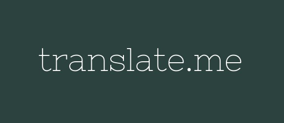
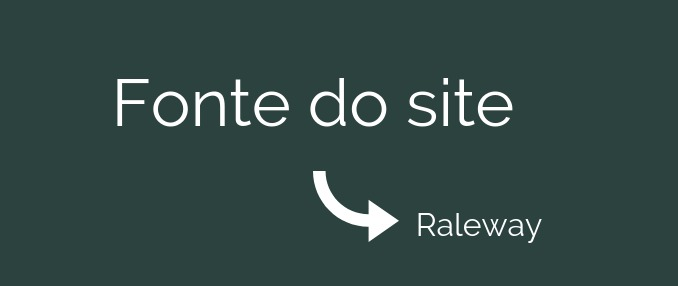

# Identidade Visual

## Histórico de Revisão:
| Data | Versão | Descrição | Autor |
|---|---|---|---|
| 18/04/2019 | 1.0 | Primeira versão do documento|Gabriela Guedes e Helena Goulart|
| 02/05/2019 | 1.1 | Revisão do documento e adição das referências utilizadas | Alexandre Miguel e Renan Schadt |

## 1. Introdução
O presente documento define aspectos visuais para a implementação do Web App Translate.me, como as fontes utilizadas e a abordagem de feedbacks para os usuários. 

## 2. Definição de Linguagem
A linguagem será conversativa, para que o usuário tenha a sensação de que a plataforma está conversando com ele, tornando a navegação simples e interativa.

## 3. Definição de Feedbacks

Os feedbacks para os usuários seguem as seguintes heurísticas, baseadas em uma comunicação simples, visual e intuitiva das atividades desempenhadas pelo usuário:

1. A alteração da cor de elementos ao serem selecionados, tais como opções do menu, que serão apresentados em tons mais claros da paleta de cores e, ao serem selecionados, mudarão para o tons mais escuros;  
2. Dupla checagem através de avisos pop-ups, como confirmação de envio do artigo e interesse na participação da tradução;  
3. Cores de acordo com a paleta determinada, que inclui tons sóbrios para retratar a seriedade do ambiente acadêmico, tais como verde escuro e azul acinzentado;
4. Mudança de cores para avisos de natureza distintas, como conclusão do trabalho de tradução, confirmação no pedido de tradução.

## 4. Fontes

As fontes definidas para a aplicação buscam alinhar a ideia de seriedade geral para confiabulidade, agregando uma usabilidade intuitiva.

#### 4.1. Logo

A logo deve estar na fonte *Nixie One*, cujo recurso de serifas contribuem para seriedade e confiabilidade, sendo uma forma eficiente de representar a marca para os usuários.

#### 4.2. Textos

Todos os textos do site devem estar na fonte *Raleway*, cuja ausência de serifas auxilia na legibilidade dos textos e na facilidade de compreensão.

## 5. Cores

### 5.1. **Cor primária**

Em prol do tom de seriedade, confiança, crescimento e sobriedade,a cor verde indigo foi escolhida como cor primária para os elementos da aplicação.

**#2B423E - Verde Indigo**  
&nbsp;&nbsp;&nbsp;&nbsp;&nbsp;&nbsp; Cor contrastante: Branco fantasma  
&nbsp;&nbsp;&nbsp;&nbsp;&nbsp;&nbsp; Relação de contraste: 10.36  

### 5.2. **Cores secundárias**

Como acompanhamento para a cor verde indigo principal, as demais cores agem como auxílio, compondo ainda a ideia de seriedade transmitida e contrastando com o tom principal, auxiliando no uso e identificação de diferenças de coloração por pessoas com vertentes do daltonismo.

**#8693AB - Cinza Azulado**  
&nbsp;&nbsp;&nbsp;&nbsp;&nbsp;&nbsp; Cor contrastante: Verde Indigo  
&nbsp;&nbsp;&nbsp;&nbsp;&nbsp;&nbsp; Relação de contraste: 3.47

**#090B0B - Preto Esfumaçado**  
&nbsp;&nbsp;&nbsp;&nbsp;&nbsp;&nbsp; Cor contrastante: Branco fantasma  
&nbsp;&nbsp;&nbsp;&nbsp;&nbsp;&nbsp; Relação de contraste: 19

**#F9FBFC - Branco Fantasma**  
&nbsp;&nbsp;&nbsp;&nbsp;&nbsp;&nbsp; Cor contrastante: Verde Indigo   
&nbsp;&nbsp;&nbsp;&nbsp;&nbsp;&nbsp; Relação de contraste: 10.36  

## 6. Referências

- [Estudo das Cores](https://www.helpscout.com/blog/psychology-of-color/)

- [Estudo de Fontes](https://medium.com/design-ibm/how-fonts-influence-what-users-think-of-your-product-238874c593d7)

- [Aplicações de Identidade Visual em Softwares](https://www.lucidpress.com/blog/the-7-key-elements-of-brand-identity-design)
