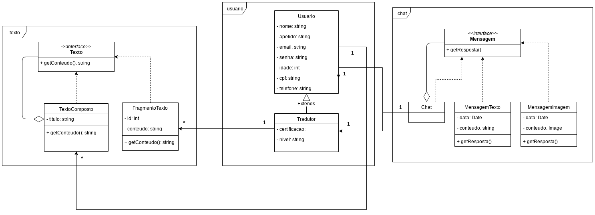

## Histórico de Revisão:
| Data | Versão | Descrição | Autor |
|---|---|---|---|
| 14/04/2019 | 0.1 | Adicionando diagrama de pacotes | Gabriela Guedes|
| 03/05/2019 | 0.2 | Estruturando padrão do documento | Victor Hugo|

## Introdução

**UML** é um acrônimo para a expressão *Unified Modeling Language*. Pela definição de seu nome, vemos que a UML é uma linguagem que define uma série de artefatos que nos ajuda na tarefa de modelar e documentar os sistemas orientados a objetos que desenvolvemos. Para o *Translate.me* foi feito uma série de modelos *UMLs* para orientação no decorrer do projeto.

## UMLs Estáticos
Diagramas umls estáticos são diagramas que tratam da parte estrutural do projeto tanto do ponto de vista do sistema quanto o das classes. Existem para visualizar e especificar aspectos estáticos da aplicação, ou seja, sua estrutua estática ou estável. Geralmente aspectos estáticos de um sistema está atrelado as definições de classes, interfaces, colaborações e componentes.

### Diagrama de Classes
Diagrama de classe mostra as diferentes classes que existem na aplicação e como ela se relacionam. Além disso, este diagrama é considerado estático pois, mostram todos os métodos e atributos das classes bem como os relacionamentos estáticos entre elas, ou seja, quais classes conhecem quais classes ou quais classes são parte das outras classes. Esse tipo de diagrama não mostram as mensagens entre elas.

### Diagrama de Pacotes
Diagrama de pacotes é básicamente o empacotamento das classes da aplicação. Apesar dos critérios de empacotamento ser subjetivo tendem a ser empacotados classes que tem relacionamento é ou modificação conjunta na aplicação. Pode ser usado para mostrar a arquitetura do sistema em questão.

### Diagrama de implantação

## UMLs Dinâmicos

### Diagrama de estados

