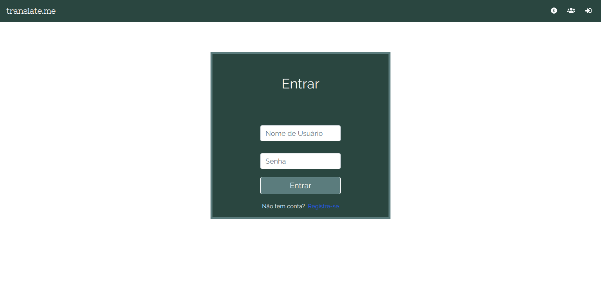
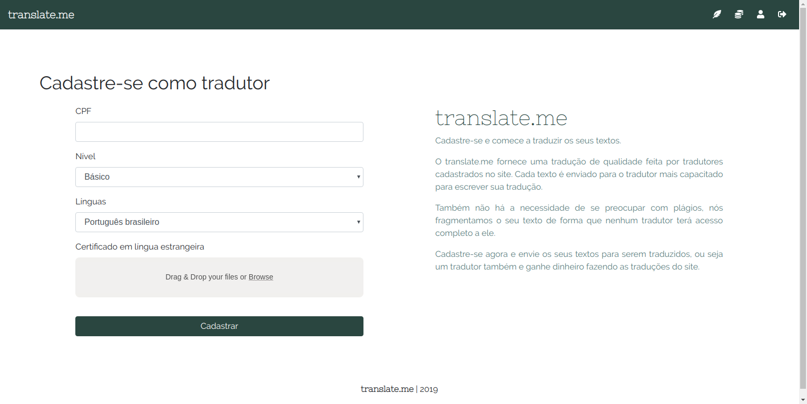

# Apresentação Final

## Histórico de Revisão:
| Data | Versão | Descrição | Autor |
|---|---|---|---|
| 01/06/2019 | 0.1 | Criação do documento | Helena Goulart |
| 01/06/2019 | 0.2 | Consertando os links do documento | Helena Goulart e Letícia Meneses |

## 1. Introdução

A equipe do translate.me preocupou-se não somente com as entregas da disciplina, mas também com a entrega de um verdadeiro produto de software. Em virtude disso, é possível analisar que foram desenvolvidos artefatos necessários para a disciplina e para o projeto, mas que o tópico de Iniciativas Extras deste repositório contém a documentação de um produto de software.

## 2. O produto

A [Definição do Tema](../def_tema.md) foi realizada através da técnica do Design Sprint. Houveram varias discussões entre a equipe a respeito de qual tipo de produto desenvolver que fosse suficiente para o portfólio, e a escolha abrangeu desde as ferramentas e frameworks envolvidos até o tipo de tema e a familiaridade da equipe com ele.

Para definir o escopo deste produto, foi realizado um [Documento de Visão](../documentos/projeto/doc_de_visao.md) que contempla as principais ideias do grupo a respeito do projeto.

Um estudo de mercado foi realizado para conhecer e aprender com a softwares similares ao translate.me, permitindo entender as funcionalidades já existentes e o diferencial do translate.me. Para acessar os resultados dessa pesquisa, basta ir até o documento de [Benchmarking](../documentos/projeto/benchmarking.md).

Além disso, o translate.me possui uma [Identidade Visual](../documentos/projeto/identidade_visual.md), tanto para garantir uma Experiência de Usuário agradável quanto para remeter a aplicação o conjunto da paleta de cores somados à fonte e logo.

**Sendo assim, este tópico abrange quatro pilares importantes para a criação de um produto: tema, escopo, estudo de mercado e identidade visual.**

## 3. Gerência

É certo que manter e organizar uma equipe de dez pessoas para a execução de um projeto tende a ser uma atividade desafiadora. Por isso a [Metodologia](../metodologia.md) foi definida e mapeada logo no início do semestre, contando com alguns aspectos da Metodologia Ágil, Schum, Kanban e XP e com as entregas da disciplina a serem realizadas paralelamente.

O modelo de negócios a ser seguido foi pontuado no [Modelo Canvas](../documentos/gerencia/canvas.md), e a análise detalhada do projeto foi pontuada através do [Termo de Abertura do Projeto](../documentos/gerencia/tap.md).

Os [Riscos do Projeto](../documentos/gerencia/riscos_projeto.md) foram estudados também no início da criação do produto, de modo que todos tivessem ciência a respeito deles e os impactos que poderiam trazer no decorrer do semestre. Para estabelecer metas e mensurar seus respectivos cumprimentos, o [GQM](../documentos/gerencia/gqm.md) foi produzido.

Antes de iniciar o desenvolvimento, foi necessário definir uma [Politica de Contribuição](../documentos/gerencia/pol_contribuicao.md), garantindo que o repositório contemplaria organização e coesão para aqueles que desejassem conhecer o projeto posteriormente.

**Observa-se então que a esta altura estavam definidos aspectos importantes para a gerência do translate.me: a equipe continha a metodologia para guiá-la no desenvolvimento, um modelo negócio para seguir, as definições do projeto detalhadas, os riscos para tomar cuidado, metas para cumprir e um repositório para contribuir de acordo com o definido.**

## 4. Funcionalidades

O escopo do projeto é definido não somente pela documentação citada em Gerência, mas também pelas funcionalidades que irá conter. A bagagem dos estudantes em disciplinas anteriores permitiu que isso fosse desenvolvido de maneira técnica. Sendo assim, houve uma elicitação de requisitos do translate.me, contemplando as seguintes técnicas: [Rich Picture](../requisitos/elicitacao/rich_picture.md), [Mapa Mental](../requisitos/elicitacao/mapa_mental.md), [Brainstorming](../requisitos/elicitacao/brainstorming.md), [Introspecção](../requisitos/elicitacao/introspeccao.md) e [Prototipagem](../requisitos/elicitacao/prototipo.md). Após essa etapa é necessário realizar a modelagem, sendo esta contemplada por [Backlogs Individuais](../requisitos/modelagem/backlogs_individuais/alexandre_backlog.md) que deram origem ao [Backlog Geral](../requisitos/modelagem/backlog_geral.md), além de conter [NFRs](../requisitos/modelagem/nfr.md) e [Tabela de Requisitos](../requisitos/tabela_requisitos.md).

**Desse modo, todas as funcionalidades haviam sido relatadas e priorizadas até então.**

## 5. Desenvolvimento

O curso de Engenharia de Software mostra como um software não é definido apenas pelo processo de desenvolvimento: é necessário modelar e documentar as camadas e pacotes para que o desenvolvimento e a manutenção do código tornem-se um processo mais claro para a equipe.

O [Documento de Arquitetura](../documentos/projeto/doc_de_arquitetura.md) foi implementado logo no início do projeto. Isso se deve ao fato de que torna-se mais claro para os membros da equipe as integrações a serem feitas e o funcionamento do frontend e do backend. Alguns dos diagramas contidos neste documento também constam no documento de [UMLs estáticos](../desenho_de_software/uml/uml_estaticos.md), tais como diagramas de classes, diagramas de pacotes e diagramas de implantação, assim como foram feitos no documento de [UMLs dinâmicos](../desenho_de_software/uml/uml_dinamicos.md) dos quais foram produzidos diagramas de sequência, diagramas de estados, diagramas de colaboração e diagramas de atividades. Torna-se importante ressaltar que o Documento de Arquitetura contém também a análise de dimensionamento, desempenho e qualidade, nos quais alguns já haviam sido desenvolvidos anteriormente na documentação de gerência.

Um dos principais focos da disciplina Arquitetura e Desenho de Software são os padrões de projeto. Eles são essenciais para solucionar situações que acontecem normalmente em projetos de software de diferentes tipos. Contudo, nem todos os padrões de projeto podem ser aplicados, e essa variação se deve ao framework utilizado, linguagem e escopo do projeto. O estudo sobre os padrões que poderiam ser aplicados no translate.me pode ser conferido em [GRASP](../desenho_de_software/padroes/grasp.md), [GoFs Criacionais](../desenho_de_software/padroes/gof/criacionais.md), [GoFs Estruturais](../desenho_de_software/padroes/gof/estruturais.md) e [GoFs Comportamentais](../desenho_de_software/padroes/gof/comportamentais.md), e alguns padrões foram detalhados nas entregas realizadas em sala de aula, conforme pode ser conferido em [GoFs apresentados em sala de aula](../desenho_de_software/padroes/gof/seminarioParteA.md) e [Padrões Emergentes apresentados em sala de aula](../desenho_de_software/padroes/gof/seminarioParteB.md).

**Este tópico apresenta como a equipe teve condições de realizar um desenvolvimento de código acoplado, coeso e de possível manutenção devido ao suporte dado pela matéria e as documentações extras realizadas.**

## 6. O trabalho em equipe

A equipe realizou reuniões semanais de acordo com o proposto pela metodologia, e todas as reuniões foram documentadas conforme pode ser visto em [Reuniões](../reunioes/sprints/sprint_0.md). Para acompanhar o desenvolvimento de software e todo o trabalho da equipe, é necessário acessar o github do translate.me. O github do produto contém diferentes repositórios, os quais se dividiram entre:

(1) [Docs](https://github.com/translate-me/docs), que contém a documentação submetida na Wiki;  
(2) [Frontend](https://github.com/translate-me/frontend), onde foi desenvolvido o código de frontend do projeto;  
(3) [Translate-me](https://github.com/translate-me/translate-me), no qual consta o código do backend do projeto;  
(4) [Profile](https://github.com/translate-me/profile), que contém o serviço do perfil;  
(5) [Authentication](https://github.com/translate-me/authentication), no qual contém o serviço de autenticação;  
(6) [Exemplos GoF](https://github.com/translate-me/exemplosGOF), onde foi incluido parte do material de GoFs para um dos seminários.

**Tendo em vista que as reuniões foram documentadas, é possível acompanhar a equipe durante todo o semestre, seus cumprimentos e falhas com a metodologia, entrega de documentação e entregas da disciplina.**

## 7. O produto

A seguir encontram-se algumas telas do produto final do translate.me:

(1) Quem somos nós

(2) Landing page

(3) Login

(4) Cadastro como tradutor

**Por fim, observa-se que a equipe do translate.me alcançou o objetivo de realizar as entregas da disciplina, bem como ter um produto de software como portólio ao final do projeto. Para verificar o produto na íntegra, recomenda-se a execução do projeto em seu computador.**

## 8. Referências

### 8.1 Sites

[1] [SourceMaking - Design Patterns](https://sourcemaking.com/design_patterns)

[2] [Explicando modelo de negócios](https://www.slideshare.net/neigrando/explicando-o-modelo-de-negcios-viradaempreendedora)

[3] [Command in Python](https://sourcemaking.com/design_patterns/command/python/1)

[4] [Strategy and Command Design Patterns — Wizards and Sandwiches — Applications in Python](https://medium.com/@rrfd/strategy-and-command-design-patterns-wizards-and-sandwiches-applications-in-python-d1ee1c86e00f)

[5] [Guia do Scrum](https://www.scrumguides.org/docs/scrumguide/v1/Scrum-Guide-Portuguese-BR.pdf)

[6] [IBM Rational Unified Process](ftp://public.dhe.ibm.com//software/pdf/br/RUP_DS.pdf)

### 8.2 Livros e artigos

[1] M. Genero, M. Piatini, E. Manso, "Finding early indicators of UML class diagrams understandability and modifiability", Empirical Software Engineering 2004. ISESE '04. Proceedings. 2004 International Symposium on, pp. 207-216, 2004.

[2] Ha Ilky, Kang Byungguk. "Cross Checking Rules to Improve Consistency between UML Static Diagram and Dynamic Diagram".

[3] NOBLE, James. GOF patterns for GUI Design. preprint of Macquarie University, Sydney Australia, 1997.

[4] [2] ELLIS, Brian; STYLOS, Jeffrey; MYERS, Brad. The factory pattern in API design: A usability evaluation. In: Proceedings of the 29th international conference on Software Engineering. IEEE Computer Society, 2007. p. 302-312
