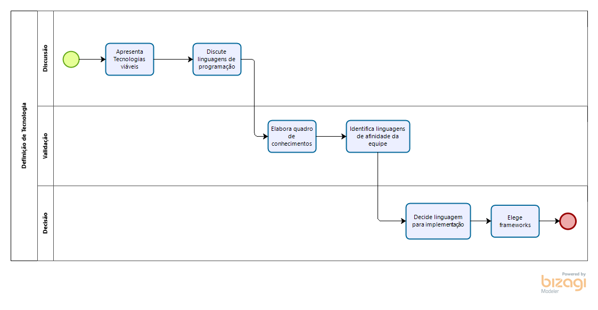
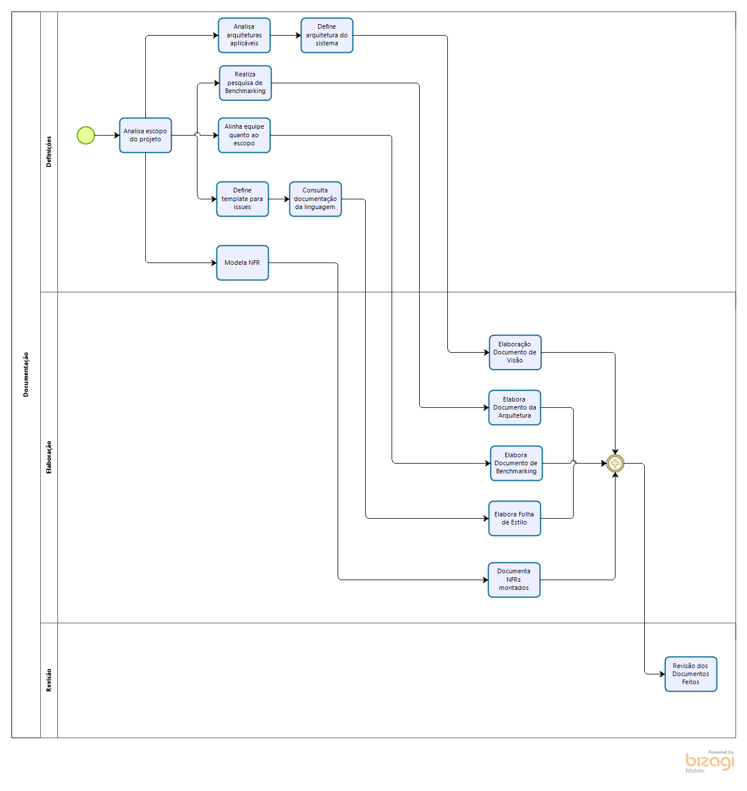
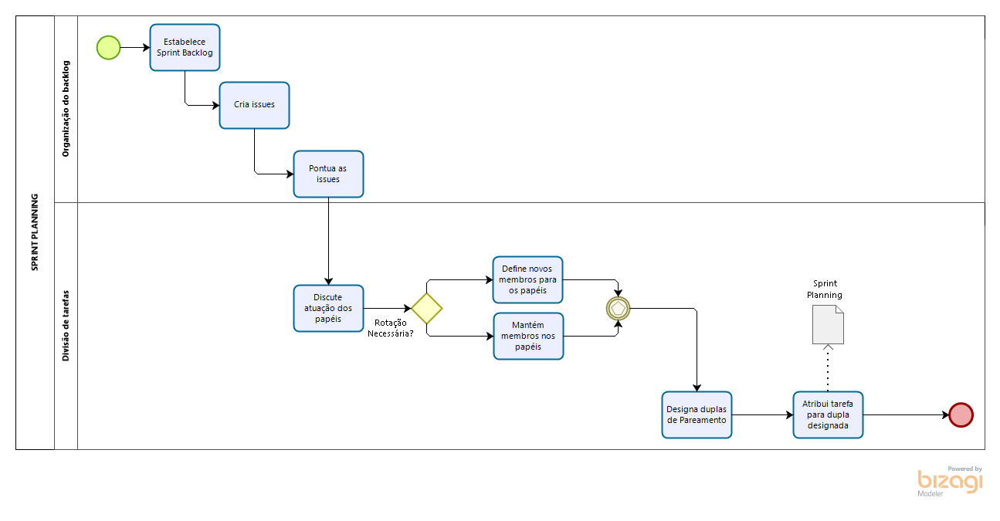

## Histórico de Revisão:
| Data | Versão | Descrição | Autor |
|---|---|---|---|
|12/04/2019|1.0|Primeira versão do documento|Gabriela Guedes|

## Introdução
A metodologia adotada no projeto foi baseada nas metodologias Scrum, Kanban, XP e RUP e se inspirando nessas metodologias, foi criada a metodologia próprio do projeto. A documentação da metodologia montada foi feita através do Bizagi.

## Metodologia Montada

### Funcionamento Geral

### Processo de Decisão de Tema

### Processo Decisão de Metodologia

### Processo Decisão de Tecnologia

### Definição do Backlog

### Documentação

### Sprint Review

### Sprint Planning

### Funcionamento da Sprint

### Acompanhamento da Sprint

### Ponto de Controle

