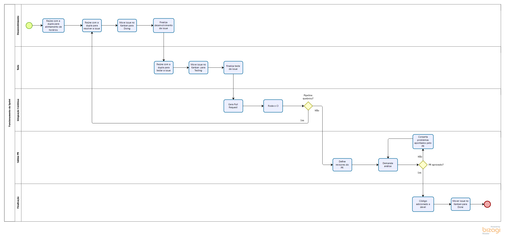

## Histórico de Revisão:
| Data | Versão | Descrição | Autor |
|---|---|---|---|
|12/04/2019 | 0.1 | Primeira versão do documento | Gabriela Guedes |
|12/04/2019 | 0.2 | Inclusão dos diagramas modelados em Bizagi | Todos os Integrantes do Grupo |
|27/04/2019 | 0.3 | Refatoração dos diagramas incluindo artefatos | Renan Schadt |
|29/04/2019 | 0.4 | Inclusão das metodologias de base | Renan Schadt |
|30/04/2019 | 0.5 | Definição da metodologia montada | Renan Schadt |
|05/05/2019 | 1.0 | Adicionado versionamento dos diagramas | Renan Schadt |
 
## 1. Introdução
Este documento tem por finalidade definir a metodologia a ser utilizada no projeto, descrevendo as metodologias usadas como base, mostrando os artefatos e rotinas selecionados destas e modelando os processos feitos através do Bizagi.

## 2. Metodologias de Base
### 2.1 Scrum
O Scrum é uma metodologia ágil que contém diversas rotinas para manter a equipe engajada e atualizada sobre o projeto, a se organizarem enquanto resolvem um problema e a refletirem sobre os êxitos e fracassos para melhorarem continuamente. Scrum é um framework estrutural usado para gerenciar o desenvolvimento de produtos. Ele é fundado nos princípios de transparência, inspeção e adaptação. Aos princípios do Scrum integramos eventos, papéis e artefatos, administrando as relações e interações entre eles.

Os papéis do Scrum são Product Owner, Architect, Scrum Master e time de desenvolvimento. O Product Owner é o responsável por maximizar o valor do produto e gerenciar o Product Backlog, garantindo que ele está claro para toda equipe. O Architect é responsável por elaborar a arquitetura do software e garantir que ela seja seguida. O Scrum Master tem a função de garantir que a equipe está cumprindo as regras da metodologia. O time de desenvolvimento, tem a função de incrementar o produto a cada sprint.

Os eventos do Scrum são: Sprint (período de um mês ou menos onde a equipe se dedica a incrementar o produto), Planejamento de Sprint (reunião ao início de cada sprint onde a equipe decide o que será feito nesta), Review e Retrospectiva da Sprint (a equipe analisa como foi a sprint e quais atividades atividades e artefatos alocados a ela foram finalizados) e Daily (reunião diária para alinhamento da equipe sobre o andamento da sprint).

Os artefatos do Scrum são: Product Backlog (lista ordenada de tudo que é necessário no produto), Sprint Backlog (conjunto de itens do backlog do produto selecionados para a sprint) e Incremento (soma de todos os itens do backlog do produto completados durante uma sprint).

### 2.2 Kanban
O Kanban, trata-se de uma simbologia visual usada no desenvolvimento de produtos para registrar o progresso das atividades. Essa metodologia foi criada pela empresa Toyota e integra o famoso sistema Toyota de produção.

O Kanban é orientado através de colunas, em que cada uma representa diferentes estados de completeza de uma atividade (a fazer, fazendo, feito), as atividades (cartões visuais) vão transitando entre as colunas, mostrando o andamento do projeto.

### 2.3 XP
XP é um apelido carinhoso de uma metodologia ágil de desenvolvimento designada Extreme Programming, com foco em produzir softwares de qualidade e fornecer qualidade de vida aos desenvolvedores. Os cinco valores básicos do XP são:

1. Comunicação: Fundamental para transferir conhecimento entre o time, o framework apoia a comunicação cara a cara, com o apoio de quadro branco e outros mecanismos de desenho.

2. Simplicidade: Evitar desperdícios e só fazer o que é necessário e útil, de maneira a facilitar o entendimento e a manutenção do produto.

3. Feedback Constante: Através do feedback constante é possível identificar pontos a melhorar no software e produzir melhorias e evoluções rapidamente, assim que uma fragilidade é detectada, ajustando os próximos passos do desenvolvimento.

4. Coragem: Coragem para tomar decisões mal-vistas no presente, que irão trazer bom retorno no futuro, como levantar problemas organizacionais que reduzem a produtividade do time, aceitar e reagir a um feedback negativo, parar de fazer algo que não está funcionando e tentar algo diferente.

5. Respeito: É necessário respeito entre os membros da equipe para que haja boa comunicação, trabalhando juntos para identificar problemas e solucioná-los.

Extreme Programming é dinâmica e flexível, entre as suas "boas práticas" é possível citar: TDD, Comentários em código, diversas entregas pequenas, programação em pares, testes de aceitação, planejamento por pontos, refatoramento, presença constante do cliente, integração contínua, entre outros.

### 2.4 RUP

Segundo o documento descritivo do IBM Rational Unified Process, em mais de 20 anos de experiência trabalhando com clientes em milhares de projetos, o grupo IBM Rational construiu uma biblioteca de práticas comprovadas para desenvolvimento de softwares, extensíveis e escaláveis para se adaptarem às necessidades específicas dos projetos. O IBM Rational Unified Process (ou IBM RUP), é uma biblioteca abrangente que fornece práticas centradas em torno de um conjunto de princípios que a IBM achou que caracterizam as mais bem sucedidas organizações de sistemas e software do mundo:

* Adaptar o processo

* Balencear as prioridades dos __stakeholders__

* Colaboração entre as equipes

* Demonstrar valor iterativamente

* Elevar o nível de abstração

* Foco na qualidade

Esses princípios ajudam a melhorar a produtividade individual e a colaboração de equipe para criar software e sistemas de alta qualidade, permitindo a construção de aplicações flexíveis que podem crescer e se adaptar.

"Para projetos menores com equipes fixas e tecnologia conhecida, os processos podem ser simples e informais. Para projetos maiores e distribuídos, que usam mais tecnologias e têm que estar de acordo com padrões mais rígidos, os processos se tornam mais complexos
e disciplinados." (IBM Rational Unified Process - Disponibilizado em: ftp://public.dhe.ibm.com//software/pdf/br/RUP_DS.pdf) 

Conforme o documento descritivo do IBM Rational Unified Process, a solução Rational Unified Process fornece uma coleção de processos que podem ser personalizados para abordar um conjunto diverso de necessidades de projeto e estilos de desenvolvimento. É capaz de suportar virtualmente qualquer tipo de esforço de desenvolvimento – de projetos ágeis e iterativos usando orientação de processo leve, a processos mais formais e regulatórios. É possível adaptar o processo ao tamanho e a distribuição da equipe de projeto, aos sistemas, diferentes e complexos das aplicações sendo desenvolvidas, e aos requisitos de conformidade.

## 3. Metodologia Montada
A metodologia adotada no projeto foi híbrida, baseada nos modelos do Scrum, Kanban, XP e RUP, além da inclusão de alguns artefatos pertinentes para demonstrar melhor nosso produto e como ele está sendo desenvolvido e rotinas pertinentes para organizar melhor o grupo.

Decidimos utilizar uma metodologia deste tipo, pois nenhuma das metodologias puristas se encaixava em nosso contexto. Seja pelo excesso de documentação, no caso do RUP; excesso de rotinas, no caso do Scrum; ou pela falta destas, no caso do XP e Kanban.

Nos sub-tópicos abaixo mostramos quais elementos das metodologias definidas acima foram aplicados no projeto.

### 3.1 Elementos SCRUM
As seguintes rotinas provindas do SCRUM foram utilizadas no projeto:

1. Sprints com duas semanas de duração

2. Reunião de Planejamento da Sprint

3. Reunião de Review da Sprint

4. Reunião de Retrospectiva da Sprint

5. Reuniões com time-box

Os seguintes artefatos provindos do SCRUM foram utilizados no projeto:

1. Product Backlog

2. Sprint Backlog

3. Documento de Planejamento da Sprint

4. Documento de Revisão da Sprint

5. Definição de pronto

O modelo de papéis do SCRUM foi utilizado no projeto, contando com Product Owner, Architect, Scrum Master e time de desenvolvimento.
O SCRUM é a metodologia base do projeto, principalmente no que se refere a rotinas, provendo maneiras eficazes para controle do grupo durante o desenvolvimento. Os artefatos do SCRUM servem como base para realizar as rotinas.

### 3.2 Elementos Kanban
O grupo decidiu aplicar o Kanban para possibilitar o acompanhamento do progresso das tarefas definidas, através do plug-in ZenHub. As tarefas são bem documentadas e cada "card" pode receber comentários, com dúvidas e outros tipos de feedback.

Aplicamos as seis práticas básicas do Kanban: Visualizar o fluxo de trabalho (workflow), limitar a quantidade de trabalho em andamento (WIP), gerenciar e medir o fluxo, tornar as políticas do processo explícitas, implementar loops de feedback e usar modelos para reconhecer oportunidades de melhoria, para extrairmos o máximo da técnica.

Como nossa metodologia não contém dailys, uma parte da comunicação é feita nas issues do ZenHub, que são usadas para verificar critérios de aceitação, demandar revisão, comunicar dificuldades, esclarecer pontos críticos, entre outros.

### 3.3 Elementos XP
Os seguintes artefatos e rotinas do XP foram adotados: 

1. Comentários em Código

2. Entregas Pequenas

3. Programação em Pares

4. Planejamento por Pontos

5. Refatoramento

6. Integração Contínua

A equipe segue os cinco princípios básicos do XP: comunicação, simplicidade, feedback constante, coragem e respeito.

### 3.4 Elementos RUP
Os seis princípios básicos do RUP são seguidos pelo grupo, são eles:

1. Adaptar o processo

2. Balencear as prioridades dos __stakeholders__

3. Colaboração entre as equipes

4. Demonstrar valor iterativamente

5. Elevar o nível de abstração

6. Foco na qualidade

Como o RUP é uma solução privada e altamente personalizável, o grupo decidiu apenas seguir alguns padrões e templates dessa metodologia. Podemos destacar modelos UML estáticos e dinâmicos, templates de diversos documentos como visão, arquitetura, termo de abertura do projeto, entre outros.

## 4. Diagramas
Abaixo estão 11 diagramas, modelados utilizando a notação BPMN e o software modelador de processos Bizagi, que ilustram a organização, tarefas e artefatos gerados pelo grupo, caracterizando o que chamamos de metodologia.

Para auxiliar no entendimento da metodologia e do software em questão o grupo utilizou um manual disponibilizado pela Secretaria de Estado de Gestão e Planejamento de Goiás, que está disponível nas referências deste documento.

Os títulos dos diagramas mostram qual processo ele define. O diagrama 4.1 compreende o funcionamento geral da nossa metodologia, contendo sub-processos que representam outros diagramas, os artefatos nesse diagrama foram omitidos para melhorar a clareza deste, de qualquer forma eles estão detalhados nos modelos sequentes. Os diagramas 4.2 a 4.6, compreendem processos realizados no começo do projeto, cada um deles realizado uma única vez, antes da fase de desenvolvimento, marcando um rastro e funcionando como um passo-a-passo do que foi feito. Os diagramas 4.7 a 4.11 compreendem processos cíclicos, que ocorrem ao longo do desenvolvimento diversas vezes e ilustram o funcionamento das sprints neste projeto.

### 4.1 Funcionamento Geral
Funcionamento Geral - V1.0

Funcionamento Geral - V1.1

### 4.2 Processo de Decisão de Tema
Processo de Decisão de Tema - V1.0

Processo de Decisão de Tema - V1.1

### 4.3 Processo Decisão de Metodologia
Processo Decisão de Metodologia - V1.0

Processo Decisão de Metodologia - V1.1

### 4.4 Processo Decisão de Tecnologia
Processo Decisão de Tecnologia - V1.0

Processo Decisão de Tecnologia - V1.1

### 4.5 Definição do Backlog
Definição do Backlog - V1.0

### 4.6 Documentação
Documentação - V1.0

Documentação - V1.1

### 4.7 Sprint Review
Sprint Review - V1.0

Sprint Review - V1.1

### 4.8 Sprint Planning
Sprint Planning - V1.0

Sprint Planning - V1.1

### 4.9 Funcionamento da Sprint
Funcionamento da Sprint - V1.0

Funcionamento da Sprint - V1.1

### 4.10 Acompanhamento da Sprint
Acompanhamento da Sprint - V1.0

### 4.11 Ponto de Controle
Ponto de Controle - V1.0

## 5. Referências
 * [Guia do Scrum](https://www.scrumguides.org/docs/scrumguide/v1/Scrum-Guide-Portuguese-BR.pdf)
 * [Kanban](https://www.culturaagil.com.br/kanban-do-inicio-ao-fim/)
 * [Extreme Programming](https://www.agilealliance.org/glossary/xp/)
 * [IBM Rational Unified Process](ftp://public.dhe.ibm.com//software/pdf/br/RUP_DS.pdf)
 * [Manual de Modelagem de Processos com Bizagi Modeler](http://www.sgc.goias.gov.br/upload/arquivos/2017-04/manual-de-modelagem-de-processos-usando-bizagi.pdf)
