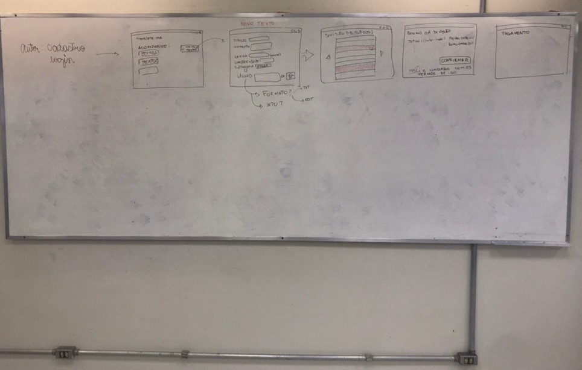

# Brainstorming

## Histórico de Revisão:

| Data | Versão | Descrição | Autor |
|---|---|---|---|
| 12/04/2019 | 1.0 | Primeira versão do documento| Gabriela Guedes|
| 13/04/2019 | 1.1 | Adicionando Informações do Brainstorming Realizado | Alexandre Miguel |
| 05/05/2019 | 1.2 | Incluindo referências | Letícia Meneses |
| 07/05/2019 | 1.3 | Revisão Final | Gabriela Guedes e Renan Schadt |

## 1. Introdução

O brainstorming é uma técnica para juntar informações e levar a pessoa ou equipe a um pensamento criativo, em que, de forma organizada, várias pessoas falam e expõem seus pontos de vista e chegam em um denominador comum. O objetivo é que a equipe possa obter ideias inovadoras para aplicar e colocar um projeto em prática. Uma característica marcante no brainstorming é abranger todas as ideias, sem dispersar nenhuma e considerar a todas. Tudo o que for sugerido deve ser anotado e analisado, tendo como foco a viabilidade de ser colocado em prática.

O inicio da compreensão do projeto junto com a equipe foi feito a partir de um brainstorming para definir melhor a ideia proposta. As ideias foram discutidas e agrupadas pela equipe e foram definidos épicos a partir disso.

## 2. Informações

| Dados | Informações|
| --- | --- |
| **Data** | 30/03/2019 |
| **Participantes** | Alexandre Miguel   Gabriela Guedes   Helena Goulart   Luiz Guilherme   Renan Schadt   Victor Hugo |
| **Local** | FGA |

## 3. Metodologia

### 3.1. Etapa 1 - Ideias

Para essa primeira etapa, diversas ideias foram expostas em formas de palavras sem contexto específico, sendo essas palavras anotadas no quadro para memorização e posterior manipulação. Foi produzido, também, um áudio dessa etapa, o qual se encontra no link: [Áudio_Brainstorming](https://drive.google.com/file/d/1eQUj43HaWzndOX-65U22wZPKXpsnREv8/view?usp=sharing).

#### 3.1.1. Palavras Anotadas

### 3.2. Etapa 2 - Seleção

Após as palavras propostas estarem todas no quadro, foi realizado um processo de filtragem, em que o significado de cada palavra no projeto foi discutido, sua relevância também foi mensurada e, palavras que representam um escopo maior, foram selecionadas e atribuídas o papel de representantes de pacotes, como é visível na figura a seguir.

#### 3.2.1. Palavras Selecionadas

### 3.3. Etapa 3 - Transcrição

A etapa de transcrição ocorreu tanto durante a **Etapa 1** quanto na **Etapa 2** , perimitindo observações e uma estrutura em lista que facilita a visualização dos aspectos elaborados na discussão, permitindo que outras abordagens fossem realizadas para a elaboração do escopo do produto.

#### 3.3.1. Definição de Tópicos

|  Tópico | Associações |
| --- | --- |
| **Login** | ***Senha***   ***Perfil***   ***Facebook***   ***Gmail***   ***Usuário***    &nbsp;&nbsp;&nbsp;&nbsp; - Aqui chamado de "Autor" ou "Tradutor"  |
| **Tradutor (Entidade)** | ***Anonimato***   ***Cooperativismo***   ***Freelancer***   ***Portfólio***   ***Referências***   ***Impessoalidade***   ***Certificação*** |
| **Segurança** | ***Dados***   ***Criptografia***   ***Copyright***   ***Termos de Uso***    &nbsp;&nbsp;&nbsp;&nbsp; - Bem definido para evitar processos |
| **Gamificação** | ***Níveis***   &nbsp;&nbsp;&nbsp;&nbsp; - Categorias   &nbsp;&nbsp;&nbsp;&nbsp; - Badges (Pokémon)   ***Ranking***   &nbsp;&nbsp;&nbsp;&nbsp;  - Penalidade para atrasos   &nbsp;&nbsp;&nbsp;&nbsp; - Penalidade para baixa qualidade   &nbsp;&nbsp;&nbsp;&nbsp; - Quantidade de textos em andamento relacionado ao nível   ***Nota***   ***Avaliação***   ***Recompensa*** |
| **Tradução** | ***Fragmento***   &nbsp;&nbsp;&nbsp;&nbsp; - Divisão pelo usuário com auxílio da interface gráfica   &nbsp;&nbsp;&nbsp;&nbsp; - Indicação de começo e final de Tópicos   ***Texto***   &nbsp;&nbsp;&nbsp;&nbsp; - Método de Inserção:   &nbsp;&nbsp;&nbsp;&nbsp;&nbsp;&nbsp;&nbsp;&nbsp;&nbsp;&nbsp;&nbsp;&nbsp;&nbsp;&nbsp;&nbsp;&nbsp; - ODT   &nbsp;&nbsp;&nbsp;&nbsp;&nbsp;&nbsp;&nbsp;&nbsp;&nbsp;&nbsp;&nbsp;&nbsp;&nbsp;&nbsp;&nbsp;&nbsp; - TXT   &nbsp;&nbsp;&nbsp;&nbsp;&nbsp;&nbsp;&nbsp;&nbsp;&nbsp;&nbsp;&nbsp;&nbsp;&nbsp;&nbsp;&nbsp;&nbsp; - Input Nativo   ***Artigo***   ***Línguas***   ***Contexto***   &nbsp;&nbsp;&nbsp;&nbsp; -  Resumo   &nbsp;&nbsp;&nbsp;&nbsp; - Sistema de Keywords   &nbsp;&nbsp;&nbsp;&nbsp; -  Traduções Fixas estabelecidas pelo autor   ***Categorias***   &nbsp;&nbsp;&nbsp;&nbsp; - Tags de Complexidade   ***Complexidade***   ***Revisão***   &nbsp;&nbsp;&nbsp;&nbsp; - É penalizado por revisões incompetentes   &nbsp;&nbsp;&nbsp;&nbsp; - Limita novas traduções   ***Acompanhamento***   &nbsp;&nbsp;&nbsp;&nbsp; - por porcentagem   &nbsp;&nbsp;&nbsp;&nbsp; - Identificar a porcentagem por processo finalizado, como um tradutor passar para etapa de revisão   ***Slangs (Gírias)***   ***Serviço***   ***Confiabilidade***    &nbsp;&nbsp;&nbsp;&nbsp; - Anpalise de privacidade de acordo com divisão |
| **Usabilidade** | ***Identidade Visual***   ***UX***   ***UI***   ***Amigável***   ***Ajuda***   ***Serviço***   ***Tutorial***   ***Responsividade***   ***Acessibilidade***   |
| **Pagamento** | ***Reembolso***   ***Volume de Trabalho***   ***Prazo***   ***Budget (Orçamento)***   &nbsp;&nbsp;&nbsp;&nbsp; - Carteira Virtual    &nbsp;&nbsp;&nbsp;&nbsp; - Resgate|
| **Contato** | ***Chat***    &nbsp;&nbsp;&nbsp;&nbsp; - Notificação por Email  ***Dúvida*** |

De forma geral, foi possível notar um afunilamento dos tópicos da tabela anterior com os épicos do [Backlog](../../modelagem/backlog_geral) montado bem como dos servições analisados na arquitetura.

### 3.4. Etapa 4 - Prototipação

Para alinhamento da equipe com a aplicação elaborada após as etapas mais abstratas, foi realizada uma prototipação conceitual, contando com apoio da representação visual no quadro branco para a elaboração de alguns fluxos da aplicação, como o fluxo de login, cadastro e traduções.

#### 3.4.1. Protótipo - Fluxo Autor

Representação do primeiro esboço do fluxo geral do autor, com as informações principais

#### 3.4.2. Protótipo - Fluxo Tradutor

Representação do primeiro esboço do fluxo geral do tradutor, com as informações necessárias

## 4. Conclusão

Após a realização do brainstorming, a equipe concluiu que a formalização dos requisitos seria realizada individualmente, em prol da montagem de backlogs individuais que representassem as abordagens para o desenvolvimento da aplicação esboçada, o que é melhor descrito no documento de [Backlog Geral](../../modelagem/backlog_geral).

## 5. Referências
Conhecimentos adquiridos na disciplina de [Requisitos de Software](https://matriculaweb.unb.br/graduacao/disciplina.aspx?cod=201308)

[Novo Negócio](https://novonegocio.com.br/empreendedorismo/o-que-e-brainstorming/)

[SEBRAE](https://bibliotecas.sebrae.com.br/chronus/ARQUIVOS_CHRONUS/bds/bds.nsf/741A876FE828908203256E7C00614A23/$File/NT00002206.pdf)
