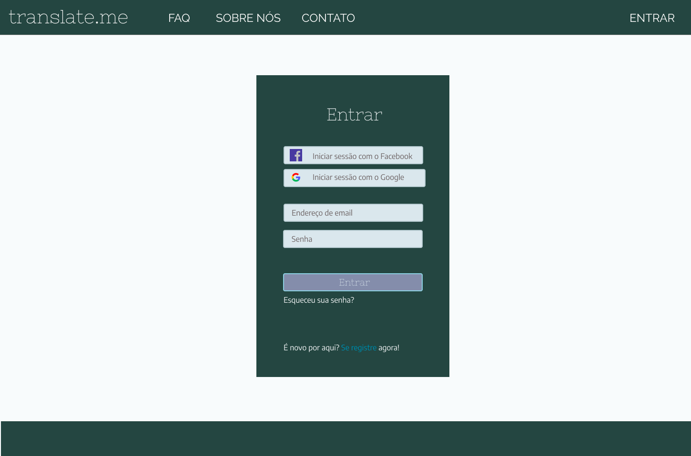
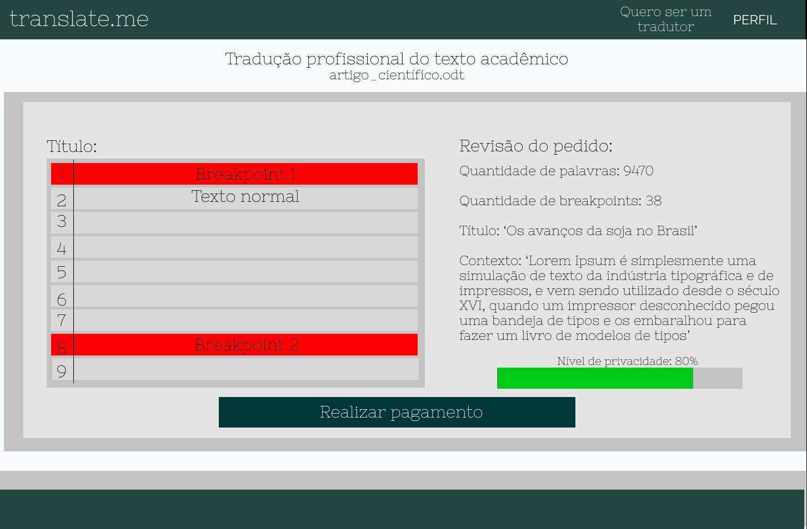
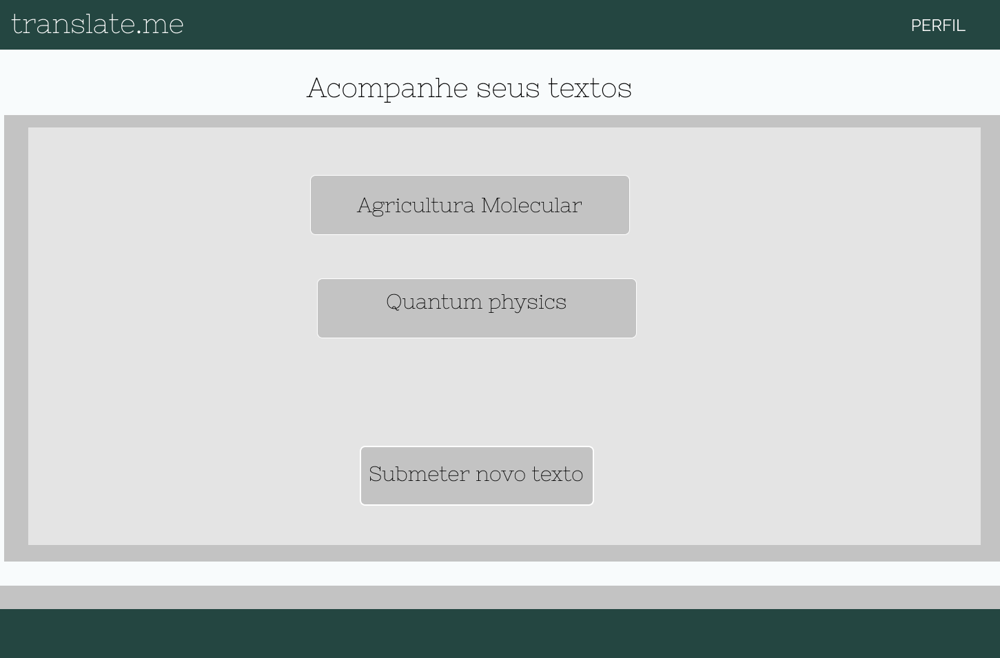
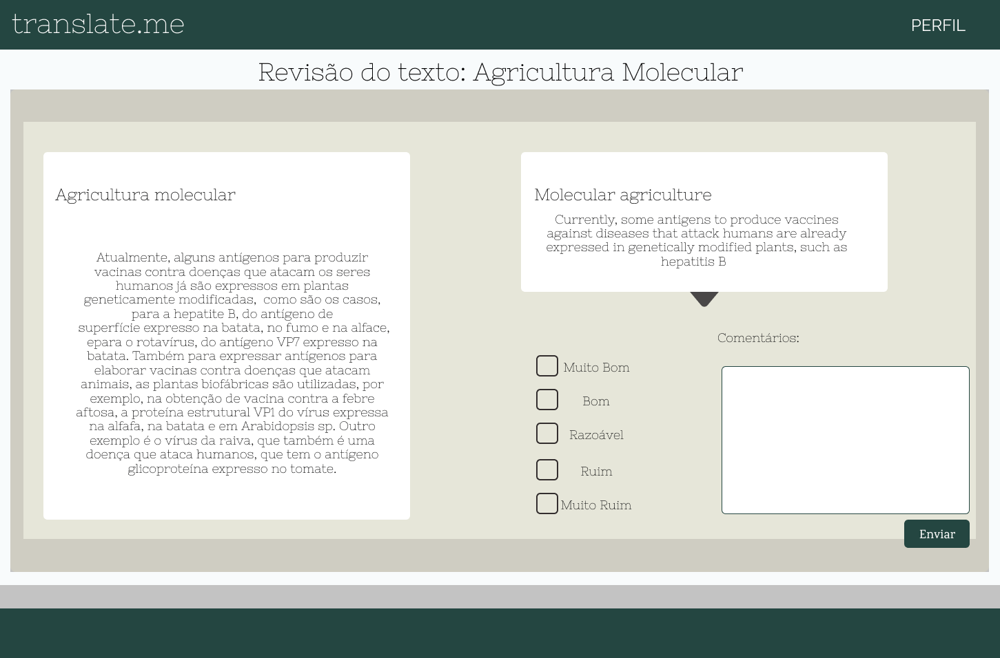
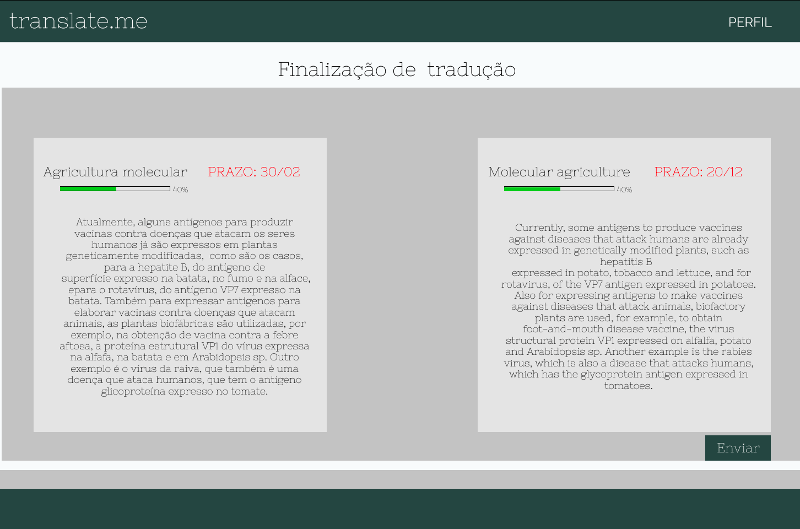

# Protótipo

## Histórico de Revisão:
| Data | Versão | Descrição | Autor |
|---|---|---|---|
| 03/05/2019 | 0.1 | Inclusão da introdução e referências | Letícia Meneses |
| 04/05/2019 | 0.2 | Adicionando as imagens do protótipo | Letícia Meneses |
|05/05/2019 | 0.3 | Explicação do protótipo | Letícia Meneses |

## Introdução
Protótipos são modelos funcionais construídos para simular a aparência de funcionalidades de um software. Para os desenvolvedores, é uma direção e gabarito na produção do sistema, enquanto os futuros usuários podem interagir e avaliar a usabilidade do software por meio do protótipo. O protótipo de alta fidelidade deve representar o produto final, em termos de aparência visual, interatividade navegação.

O protótipo de alta fidelidade foi feito com o objetivo de guiar os desenvolvedores para a implementação do projeto. Construído com base na [identidade visual](documentos/projeto/identidade_visual.md) do projeto, o protótipo visa trazer uma aproximação visual do que será a aplicação **Translate.me**, e foi desenvolvido feito com a ferramenta web **Figma**.

## Telas do protótipo

### Autenticação
A autenticação do sistema é responsável pelo sistema de cadastro login na aplicação.

 

### Tela inicial
A tela inicial da aplicação é para onde os usuários são levados após o cadastro no Translate.me. Nela contém a opção de um usuário se tornar um tradutor, possuindo um fluxo diferente para esse tipo de usuário.

 

### Submeter Texto
A tela de submissão de texto atende aos usuários autor, onde vão enviar seus textos e artigos para que usuários tradutores possam realizar o serviço de Tradução
 

### Informações do texto
Após submiter um documento, o usuário autor deve preencher os campos com informações necessárias para a tradução.

 

### Finaizar Fragmentação
O usuário autor irá fragmentar seu textos por meio da tela de fragmentação. O objetivo é que usuários tradutores não tenham acesso ao texto completo, mas sim a um fragmento do texto e seu contexto.

 

### Acompanhar Tradução
O usuário autor pode visualizar o andamento das traduções de seus textos por meio da tela de acompanhamento.

 

 
Com esse acompanhamento ele consegue ver a progressão da tradução, o prazo que receberá a tradução pronta e o fragmento.

 

### Tornar-se Tradutor
O usuário, após realizar o cadastro na aplicação, tem a opção de se tornar um tradutor, para que possar prestar serviços de traduções e receber por isso.

 

### Perfil para Tradutor
Com a tela de perfil do tradutor, o usuário tradutor consegue verificar saldos acumulados até o momento, enviar certificados para a plataforma para validar seu nivelamento, realizar novas revisões de traduções, acessar suas traduções presentes e acessar suas revisão realizadas.

 

### Revisão de Tradução
A tela de revisão de tradução tem por finalidade garantir uma melhor qualidade no serviço de tradução. Usuários tradutores podem revisar fragmentos traduzidos por outros usuários, retornando um feedback para eles.

 

### Enviar Tradução

Após o usuário tradutor finalizar seu serviço, poderá enviar tradução para o autor. E após a validação da tradução, ser pago pelo serviço.

 

## Referências
[UX Collective BR](https://brasil.uxdesign.cc/uma-r%C3%A1pido-estudo-de-prototipagem-81a1b300471b)

[Figma](https://www.figma.com/)

[High-Fidelity Prototype](https://www.usability.gov/what-and-why/glossary/high-fidelity-prototype.html)
